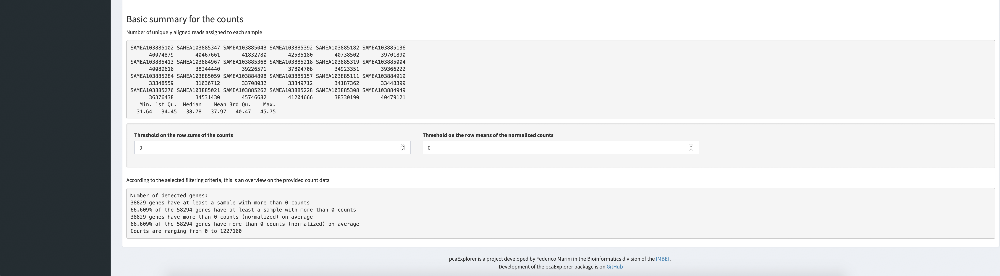

**Compiled date**: `r Sys.Date()`

**Last edited**: `r Sys.Date()`

```{r setup, include = FALSE, cache = FALSE, eval = TRUE, echo = FALSE}
library(knitr)
opts_chunk$set(
  fig.align = "center",
  fig.show = "asis",
  eval = TRUE,
  fig.width = 10,
  fig.height = 7,
  tidy = FALSE,
  message = FALSE,
  warning = FALSE,
  size = "small",
  comment = "##",
  echo = TRUE,
  results = "markup"
)
options(replace.assign = TRUE, width = 100)
```

# Loading required packages

```{r loadLibraries, results= "hide"}
library("DESeq2")
library("topGO")
library("org.Mm.eg.db")
library("pcaExplorer")
library("ideal")
library("GeneTonic")
```


# Introductory Paragraph
pcaExplorer is a Bioconductor package [https://doi.org/10.1186/gb-2004-5-10-r80] which can be seen as a general-purpose interactive companion tool for RNA-seq analyses. pcaExplorer is designed to guide the user in exploring the Principal Components (PC) [https://doi.org/10.2307/1270093] of the data under inspection. Besides the Principal Component Analysis (PCA) [https://doi.org/10.2307/1270093], pcaExplorer also provides tools to detect outlier samples, genes that show particular patterns and additionally provides a functional interpretation of the principal components for further quality assessment and hypothesis generation on the input data. 

In this protocol we describe how to launch a Shiny application [https://CRAN.R-project.org/package=shiny] of pcaExplorer with the data of the macrophage dataset [https://doi.org/10.1038/s41588-018-0046-7] which is also distributed via Bioconductor [https://doi.org/10.1186/gb-2004-5-10-r80]. 

# Necessary Resources

*Hardware*

  a modern desktop computer or laptop with any up-to-date operating system
  
*Software*

  R 3.3 or higher, Bioconductor 3.3 or higher, (optional?) RStudio, optional browser to open vignettes
  
*Files* (maybe we can describe the sample input here and how to download from Github, I've seen that in some papers rather than describing the general input format)

  pcaExplorer mainly requires 3 input files in text format. The files are expected to be tab-separated, but also comma- or semicolon-separated files are accepted (see **Alternative protocol 1**). The first input file is the count matrix which stores the number of times (i.e counts) a certain feature (e.g gene) is found in each sample. In the count matrix, the samples are stored in the columns, while the rows store the individual features (see Fig. 1).
  
  

  The second input of pcaExplorer is the metadata file. This file stores for each sample the necessary experimental variables. The individual samples represent the rows of the file while the columns save the different experimental variables (see Fig. 2).
  
  
  Lastly, the third input of pcaExplorer is optional, but highly recommended for an ease of interpretation of the results. The last input is the annotation file. The file contains the feature ids of the count matrix in the rows and at least one column called gene name which contains a more human readable form of the feature ids (e.g. HGNC gene names [https://doi.org/10.1093/nar/gkaa980] if the features are gene ids). Fig. 3 shows an example of an annotation file.
  
  

*Exploring the data with pcaExplorer* 

Before we start with the exploration of the data, the necessary packages and dependencies need to be installed and loaded. **Support Protocol 1** describes how to install and load the packages. 

1. Prepare the input data. Launch the Shiny application with the command `pcaExplorer(countmatrix, metadata, annotation)` where `countmatrix`, `metadata` and `annotation` have to be substituted by the file paths of the respective input files. To launch the application, enter the command into the console of RStudio and press the Enter-Button. This should launch a second window with the pcaExplorer application. In this application you should see the Data Upload panel as shown in Fig. 4.


2. Click the "Generate the dds and dst object" button to generate the dds and dst object needed for the exploration of the data (Fig 4). Scroll down on the Data Upload panel. After the generation of the dds and dst object you should find the 'Select one of the following transformations for your data:' option with three blue colored buttons underneath. Each button describes a different transformation of the data. The first button on the far left 'Compute variance stabilized transformed data from the `dds` object' computes a variance stabilized transformed version on the data upon clicking the button. The middle button computes a regularized logarithm transformed version of the data, while the button on the far right computes log2 data. The choice of transformation of the data in this step should be dependent on the input data. If you follow this protocol using the provided sample data, click the 'Compute variance stabilized transformed data from the `dds` object' button on the far left. 

3. At the bottom of the Data Upload panel, a preview of the input data is provided. Here you'll find four green colored buttons which provide a preview on the respective input data upon clicking. 

4. Navigate to the Counts Table panel through clicking on the panel name in the panel list at the beginning of each panel (Fig. 5). In this panel, the count information of the count matrix is shown in a table. A drop-down menu at the beginning of the panel provides the possibility to change the data scale in the table. Different options can be chosen through clicking (e.g. raw counts, normalized counts, regularized logarithm transformed counts, etc.). Users can download the counts table through clicking on the green download button below the table (Fig. 5).


5. Scroll down until you see the 'Sample to sample scatter plots' heading (Fig. 5). Choose 'pearson' as correlation method from the 'Correlation method palette'. Ensure that both options 'Use log2 values for plot axes and values' and 'Use a subset of max 1000 genes (quicker to plot)' are selected. An option is selected, if the small box in front of the option is ticked (Fig. 5). Click on the 'Run' button to generate the scatter plots. 

6. *TODO: Something about the inspection of the plot and some general remarks to the type of plots*


7. Navigate to the Data Overview panel through clicking on the panel name in the panel list at the beginning of each panel (Fig. 8). The panel shows the input metadata as table in the upper half of the panel. The number of entries shown in the table can be managed with the "Show X entries" drop down menu. Furthermore, in the right upper corner of the table, users can find a Search field, which can be used to search for specific terms in the metadata table (Fig. 8). Below the metadata table, a Sample to Sample distance heatmap can be found. This heatmap reflects the distances between the individual samples. The "Select the distance method to use" option enables users to change the distance method used for the heatmap. Furthermore, users have the option to download the heatmap via the "Download Plot" button in the lower right corner below the heatmap. In the field "Save as..." users can specify the name of the file to save the heatmap (Fig 8). 


8. Scroll down in the Data Overview panel. Below the heatmap, the panel provides further information about the input data (Fig. 9 & 10).




9. Navigate to the Samples View panel through clicking on the panel name in the panel list at the beginning of each panel (Fig. 11). When directed to the panels, users see the PCA of the individual samples of the iput data on the left side with the corresponding scree plot shown on the right side. Initially the samples shown in the PCA are not colored by any group hence it is hard to identify the characteristics of the samples along which the PCA groups the samples. In the presented data, users should color the samples by condition. To color the samples by condition, click on the "Group/color by" filed on the grey side bar at the far left of the screen. Scroll down in the drop-down menu which opens upon clicking until you find the "condition" option. Click this option. It should now be displayed in the before empty field (Fig. 12). Furthermore, the PCA plot changed displaying the samples now in 4 colors compared to one before (Fig. 12). Users can also download the PCA plor via the "Download plot" button in the lower right corner of the plot. As seen before, users can specify the name of the file they want to save the plot. This is also possible for the Screeplot on the right side of the panel. 

  *some notes about how to delete option, identifiy the right optio for you data and how to use the scree plot*


10. The Sample View panel provides the possibility to zoom in on the PCA. For this, hover your mouse over the PCA plot until your mouse pointer changes to a little plus sign. Press the left button of the mouse and move the mouse to draw a little grey rectagle (Fig. 13). Move the mouse to the upper left corner of the PCA plot and select all samples belonging to the naive condition (colored in blue in Fig. 12) as explained before. After selecting the samples, scroll down in the panel until you see a zoomed in version of the PCA plot containing mainly the selected sampels. This should somewhat look like the plot shown in Fig. 13. 


14. The zoomed in PCA plot can be downloaded via the "Download plot" button in the lower right corner below the plot. As aforementioned the name of the file to save the plot can also be specified.

15. *Something about the plot on the right sied of the zoomed in PCA*

16. Scroll down in the Sample View panel until you see the "Outlier identification" option (Fig. 14). The "Select which sample(s) to remove - suspected outliers" options provides the possibility to select individual samples, which are suspected to be outliers, and remove them from the PCA. For demonstration purposes select all samples from the "naive" condition and remove them from the PCA (the sample ids end in "102", "111", "182", "262", "284" and "368"). To remove samples from the plot, click on the field below the "Select which sample(s) to remove - suspected outliers" option. This opens a drop-won menu with the sample ids of all samples listed. Select the above mentioned sample ids until the PCA plot looks like Fig. 15.

  *Something about the plot at the bottom of the panel and overall outlier identification*


17. Navigate to the "Intructions" panel through clicking on the panel name in the panel list at the beginning of each panel (Fig. 16). Open the vignettes of pcaExplorer by clicking on the two buttons "Open the User Guide (main vignette)" and "Open the 'UP and Running' vignette". This will open the two vignettes of pcaExplorer in your selected default browser. The vignettes describe the individual panels of pcaExplorer in detail and provide walkthroughs on how to explore input data with pcaExplorer. Users are recommended to read the vignettes to fully graps the different possibilities provided with pcaExplorer.


# Session information {-}

```{r}
sessionInfo()
```
