**Compiled date**: `r Sys.Date()`

**Last edited**: `r Sys.Date()`

```{r setup, include = FALSE, cache = FALSE, eval = TRUE, echo = FALSE}
library(knitr)
opts_chunk$set(
  fig.align = "center",
  fig.show = "asis",
  eval = TRUE,
  fig.width = 10,
  fig.height = 7,
  tidy = FALSE,
  message = FALSE,
  warning = FALSE,
  size = "small",
  comment = "##",
  echo = TRUE,
  results = "markup"
)
options(replace.assign = TRUE, width = 100)
```

# Loading required packages

```{r loadLibraries, results= "hide"}
library("DESeq2")
library("topGO")
library("org.Mm.eg.db")
library("pcaExplorer")
library("ideal")
library("GeneTonic")
```


# Introductory Paragraph

pcaExplorer is a Bioconductor package [@Marini2019] which can be seen as a general-purpose interactive companion tool for RNA-seq analyses. 
pcaExplorer is designed to guide the user in exploring the Principal Components (PC) [@Jolliffe2002] of the data under inspection. 
Besides the Principal Component Analysis (PCA), pcaExplorer also provides tools to detect outlier samples and inspect their impact, genes that show particular patterns, and additionally provides a functional interpretation of the principal components for further quality assessment and hypothesis generation on the input data. 

In this protocol, we describe how to launch a Shiny application [@shiny2021] of pcaExplorer with the data of the macrophage dataset [@Alasoo2018] which is also distributed via Bioconductor [@Huber2015]. 

# Necessary Resources

*Hardware*

  a modern desktop computer or laptop with any up-to-date operating system
  
*Software*

  R 3.3 or higher, Bioconductor 3.3 or higher, (optional?) RStudio, optional browser to open vignettes
  
*Files* (maybe we can describe the sample input here and how to download from Github, I've seen that in some papers rather than describing the general input format)

**TODO: finalize input. Currently the pictures are the example data from the pcaExplorer vignette, but it would probably be better to use screenshots of the macrophage dataset? Or we describe everything in the Support Protocol? **

  pcaExplorer mainly requires 3 input files in text format. 
  The files are expected to be tab-separated, but also comma- or semicolon-separated files are accepted (see **Alternative protocol 1**). 
  The first input file is the count matrix which stores the number of times (i.e counts) a certain feature (e.g gene) is found in each sample. 
  In the count matrix, the samples are stored in the columns, while the rows store the individual features (see Fig. X).
  
  

  The second input of pcaExplorer is the metadata file.
  This file stores for each sample the necessary experimental variables. 
  The individual samples represent the rows of the file while the columns save the different experimental variables (see Fig. X).
  
  
  Lastly, the third input of pcaExplorer is optional, but highly recommended for an ease of interpretation of the results. 
  The last input is the annotation file. The file contains the feature ids of the count matrix in the rows and at least one column called gene name which contains a more human readable form of the feature ids (e.g. HGNC gene names [@Tweedie2021] if the features are gene ids). 
  Fig. X shows an example of an annotation file.
  
  

*Exploring the data with pcaExplorer* 

Before we start with the exploration of the data, the necessary packages and dependencies need to be installed and loaded. 
**Support Protocol 1** describes how to install and load the packages. 

1. Prepare the input data. Launch the Shiny application with the command `pcaExplorer(countmatrix, metadata, annotation)` where `countmatrix`, `metadata` and `annotation` have to be substituted by the file paths of the respective input files. 
To launch the application, enter the command into the console of RStudio and press the Enter-Button. 
This should launch a second window with the pcaExplorer application. 
In this application you should see the Data Upload panel as shown in Fig. X.

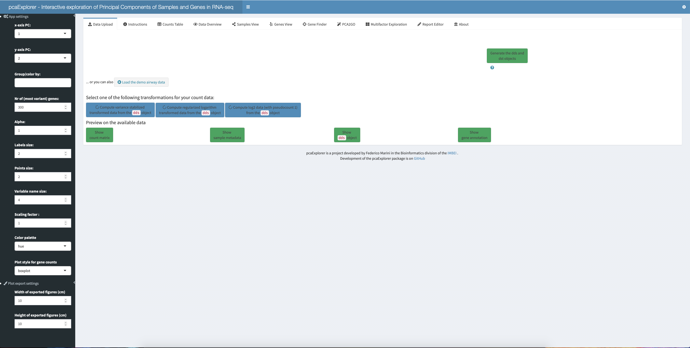

2. Click the 'Generate the dds and dst object' button (Fig X). 
The dds object represents a `DESeqDataSet` dataset object, while the dst is a `DESeqTransform` object [@Love2014]. 
Both objects are needed for the exploration of the data. After the generation of the two object the 'Select one of the following transformations for your data:' option with three blue colored buttons underneath should appear in the panel. 
Click the 'Compute variance stabilized transformed data from the `dds` object' button on the far left. 

     *pcaExplorer provides three different option for data transformation. 
     The first option is to compute a variance stabilized transformed version of the data. 
     The second is a regularized logarithm transformation of the data. 
     A log2 data transformation is also offered. 
     Users are advised to choose the data transformation according to their input data and evaluate the effects of the different transformations on their data.*

3. Scroll to the bottom of the Data Upload panel. 
A preview of the input data is provided which you can access by clicking on the green colored buttons (see Fig. X).

4. Navigate to the Counts Table panel. 
To do so, click on the panel name in the panel list at the top of each panel to navigate between individual panels (Fig. X). 
Click on Counts Table. In this panel, the information of the count matrix is shown in a table. 
A drop-down menu at the beginning of the panel provides the possibility to change the data scale in the table.
Different options can be chosen through clicking (e.g. raw counts, normalized counts, regularized logarithm transformed counts, etc.). 
Users can download the counts table through clicking on the green download button below the table (Fig. X).

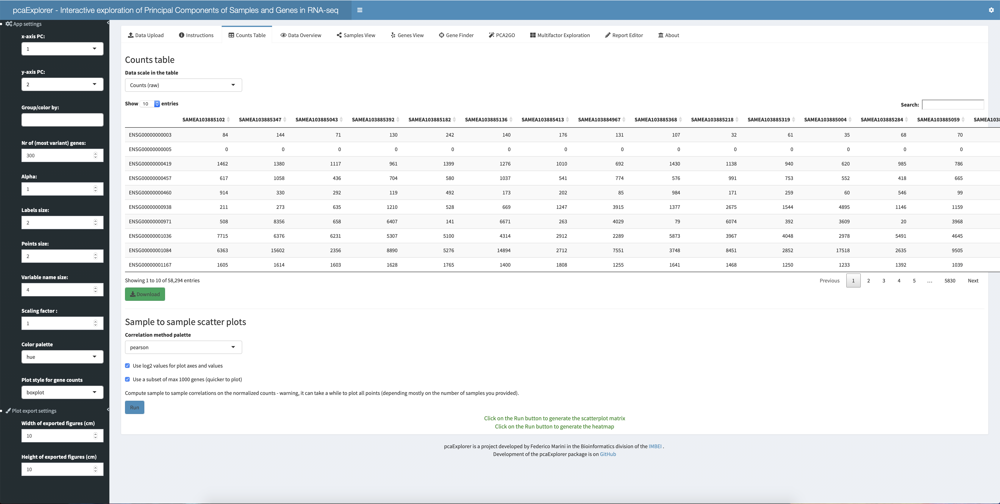

5. Scroll down until you see the 'Sample to sample scatter plots' heading (Fig. X). 
Choose 'pearson' as correlation method from the 'Correlation method palette'. 
Ensure that both options 'Use log2 values for plot axes and values' and 'Use a subset of max 1000 genes (quicker to plot)' are selected. 
An option is selected, if the small box in front of the option is ticked (Fig. X). 
Click on the 'Run' button to generate the scatter plots. 
The plots will appear after a short computation time (Fig. X and X.). 
  
    *Upon clicking the 'Run' button, pcaExplorer will generate a scatter plot (Fig. X) as well as a heatmap (Fig. X). 
    The scatter plot will represent the sample to sample correlation as scatter plots (lower triangular matrix of the result). 
    The precise values of the correlations between two samples can be found in the diagonal matching (??) field. 
    The heatmap (Fig. X) shows the sample to sample similarity. 
    The color indicates the similarity with dark blue indicating  a low similarity and dark red indicating identical samples (see diagonal of the heatmap).*

 **TODO: Maybe merge these pictures into one?**

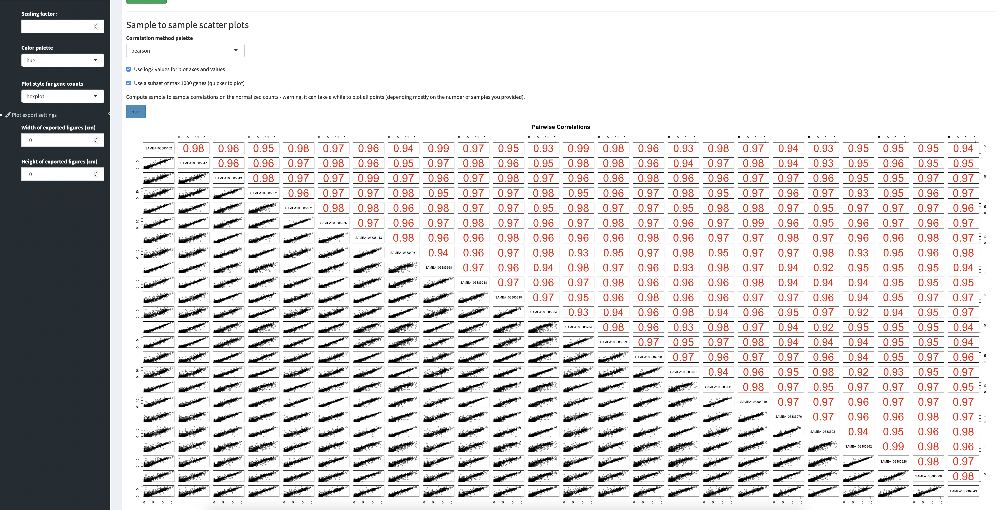

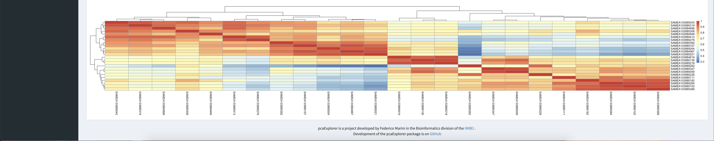

6. Navigate to the Data Overview panel (Fig. X) as explained above (**TODO: Mention exact step**). 
The panel shows the input metadata as table in the upper half of the panel. 
The number of entries shown in the table can be managed with the 'Show X entries' drop-down menu. 
Furthermore, in the right upper corner of the table, you can find a Search field, which can be used to search for specific terms in the metadata table (Fig. X). 
Below the metadata table, a Sample to Sample distance heatmap can be found. 
This heatmap reflects the distances between the individual samples. 
The 'Select the distance method to use' option enables you to change the distance method used for the heatmap.
Furthermore, you have the option to download the heatmap via the 'Download Plot' button in the lower right corner below the heatmap. 
In the field 'Save as...' you can specify the name of the file to save the heatmap (Fig X).


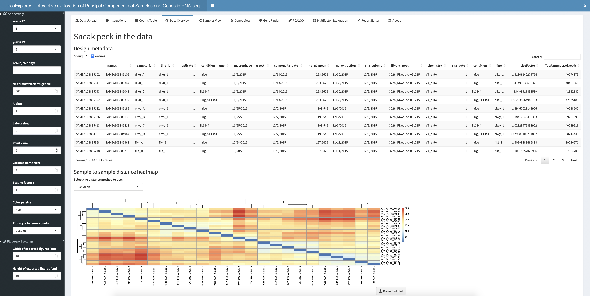

7. Scroll down in the Data Overview panel. 
Below the heatmap, the panel provides further information about the input data (Fig. X & X). 
Next, color the sample by their originating cell line. 
To color the samples by this characteristic, click on the 'Group/color by' field in the grey side bar at the far left of the screen. 
Scroll down in the drop-down menu which opens upon clicking until you find the 'line_id' option. Click this option. 
It should now be displayed in the before empty field (Fig. X). 
You can also type 'line_id' in the field instead of selecting it from the drop-down menu. 
Scroll down until you see the Number of million of reads per sample plot. 
This plot should have changed from an all grey plot to a colored plot (see Fig. X). 

    *In the provided sample data, the line_id parameter indicates the cell line of the respective sample. 
    The Number of million reads per sample plot shown in Fig. X can be used to evaluate the uniformity of reads in each sample. 
    Samples with a surprisingly high or low number of reads could later be detected as outliers, because of several different factors associated with the number of reads in a sample. 
    An inspection of the distribution of the overall number of reads in the individual sample can point users to the first source of differences in the samples found in subsequent analyses of the data.*

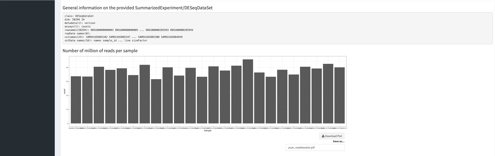

8. Scroll up again until you see the 'Group/color by' option. 
Delete the selected option by clicking on the white rectangle and hitting the delete key on your keyboard until the field is empty again. 
From the drop-down menu of options, select 'condition' as next parameter to color by. 
Instead of selecting 'condition' from the drop-down menu directly you can also select the option by typing it into the white rectangle. 
Scroll down to the Numbers of million of reads per sample. 
The plot should have changed compared to Fig. X. 

9. Scroll down to the 'Basic summary for the counts' heading. 
Here you will see the number of uniquely aligned reads per sample.
Below you will find information about the expressed genes in the data. 
You have two different options to filter the genes of the input data and hence further inspect the data. 
The first option is provided through setting the 'Threshold on the row sums of counts' option. 
In this field you can enter an arbitrary integer X to evaluate how many genes have at least X counts in the data. 
To test this option, enter 10 in the field below 'Threshold on the row sums of counts' and compare the results to the ones shown in Fig. X. 
The second option to analyze the genes in the data is the 'Threshold on the row means of the normalized counts' option. 
This option gives you the possibility to filter the genes in the data based on the means of the normalized counts of each gene. 
Enter 10 for this option and compare the results with the ones shown in Fig. X. 

    **TODO: Something about how evaluating the number of counts per gene in your sample can help with your analysis **


10. Navigate to the Samples View panel (Fig. X). 
In this panel you will see the PCA of the individual samples of the input data on the left side with the corresponding scree plot shown on the right side. 
Initially the samples shown in the PCA are not colored by any group hence it is hard to identify the characteristics of the samples along which the PCA groups the samples. 
In the presented data, you should color the samples by condition. 
To color the samples by condition, click on the 'Group/color by' field and select 'condition' from the drop-down menu (delete all previously selected characteristics as explained in step X). 
Instead of selecting the option from the menu, you can also chose to type 'condition' into the field. 
Go back to the PCA plot which should now display the samples in 4 colors compared to one before (Fig. X). 
You can also download the PCA plot via the 'Download plot' button in the lower right corner. 
As seen before, you can specify the name of the file you want to save the plot. 
This is also possible for the scree plot on the right side of the panel. 

    *The PCA plot of the sample data indicates that the most variance in the data seems to arise from the condition of the individual samples in this data set. 
    When analysing data, it is important for users to know which characteristic of their samples has the most influence (i.e. is responsible for the most variance). 
    Hence, users should select different options from the 'Group/color by' option to discover the characteristic with the most influence. 
    The scree plot right next to the PCA can also help users to evaluate how many principal components should be used to analyse the variance in the data. 
    In the example shown in this protocol, it can be easily observed that the first two components explain the nearly 80% of the variance in the data. 
    80% can be seen as a good cut-off value to select the number of principal components.*

  
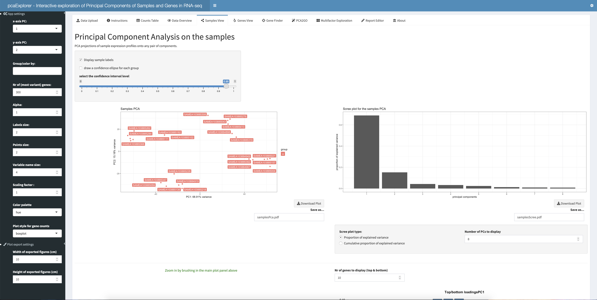


11. Navigate to the options panel on the far left and search for the 'Nr. of (most variant) genes' option. 
The default number is 300 genes. 
Change the number of genes to 500. 
To change the number of genes either use the increase and decrease buttons in the option field (indicated by small arrows) or type the number in the box. 
However when using the second option make sure to delete the previously selected number first (by hitting the delete key on your keyboard until the number disappeared). 
Inspect the PCA plot and compare it with the plot in Fig. X. The variance of the first and second principal component should have changed. 
If you increase or decrease the number of selected genes further, you should also be able to observe a difference in the clustering of the samples.

    *The PCA plot visualizes the variance in the data and the differences between the individual samples. 
    The number of genes selected for the PCA plot can influence the overall structure of the plot. 
    In order to analyze which characteristic is responsible for the variance in the data, users should also consider to change the number of genes used for the PCA. 
    This enables users to analyze the robustness of the identified characteristic.*

12. The Sample View panel provides the possibility to zoom in on the PCA. 
For this, hover your mouse over the PCA plot until your mouse cursor changes to a little plus sign. 
Press the left button of your mouse and move the cursor to draw a little grey rectangle (Fig. X). 
Move the mouse to the upper left corner of the PCA plot and select all samples belonging to the naive condition (colored in blue in Fig. X) as explained before. 
After selecting the samples, scroll down in the panel until you see a zoomed version of the PCA plot containing mainly the selected samples. 
This should somewhat look like the plot shown in Fig. X. 
As well as the full PCA plot, the zoomed version can be downloaded via the 'Download plot' button in the lower right corner below the plot. 
As aforementioned the name of the file to save the plot can also be specified.

    *The zoom functionality is especially helpful in cluttered PCA plots with many samples or particular cluttered regions of the plot.*


13. **TODO: Something about the plot on the right side of the zoomed in PCA**

14. Scroll down in the Sample View panel until you see the 'Outlier identification' option (Fig. X). 
The 'Select which sample(s) to remove - suspected outliers' option provides the possibility to select individual samples suspected to be outliers, and remove them from the PCA. 
For demonstration purposes select all samples of the 'naive' condition and remove them from the PCA (the sample ids end in '102', '111', '182', '262', '284' and '368'). 
To remove samples from the plot, click on the field below the 'Select which sample(s) to remove - suspected outliers' option. 
This opens a drop-down menu with the sample ids of all samples listed. 
Select the above mentioned sample ids until the PCA plot looks like Fig. X.

    *The sample outlier detection option can help users at identifying individual samples which are highly different from the remaining samples and hence could be possible outliers. 
    Especially for data sets with small sample numbers, the outlier identification option is useful to evaluate the influence of individual samples on the overall PCA of the data. 
    At the bottom of the Sample View panel, users also have the option to select a third principal component to visualize besides the first two. 
    This is especially helpful in data sets where the most variance of the data is scattered among several principal component and not only the first two.*
  
  **TODO: Maybe we can merge the next two figures**

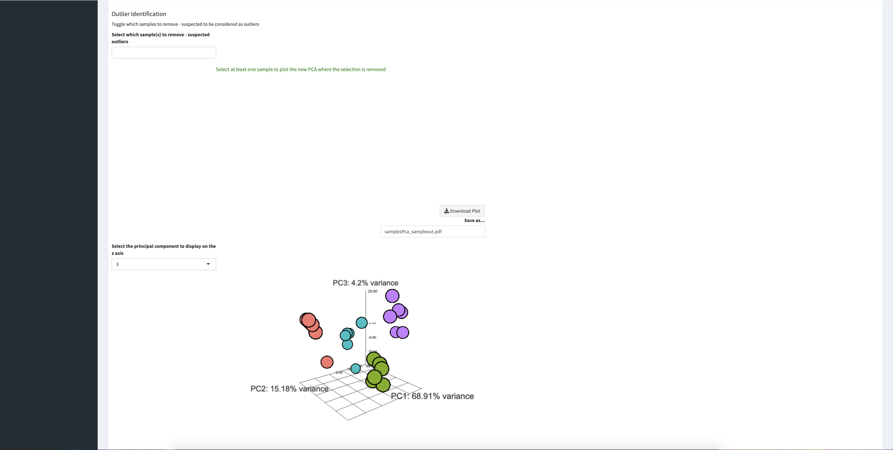

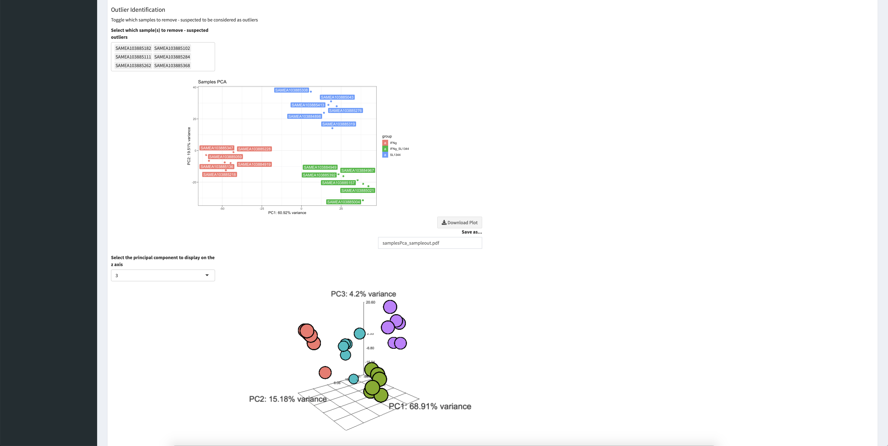

15. Navigate to the Genes View panel (Fig. X). 
In this panel you will see a PCA on the individual genes of the samples compared to the PCA on the individual samples of Fig. X. 
As previously, you can select a section of the plot to zoom which will be shown on the right side in the 'Zoomed window'. 
To select a region to zoom, hover your mouse cursor over the plot until it changes to a plus sign. 
Press the left mouse button and drag you mouse until the region you wish to zoom in is highlighted by a grey rectangle. 
The zoomed version of the plot will appear under 'Zoomed window' (Fig. X). 
On the left of the panel, select 'condition' as 'Group/color by' as explained above. (**TODO: mention exact steps here**) 
After selecting a condition, a plot should appear below the 'Profile explorer' heading (Fig. X). 

    *(**TODO: explain what the profile explorer plot shows**)* 
    
    **TODO: Maybe we can also shown only one of the following pictures and mentioning the zoom functionality.**

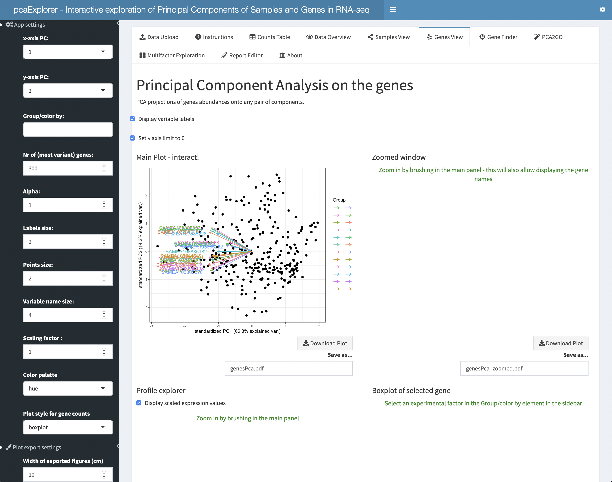
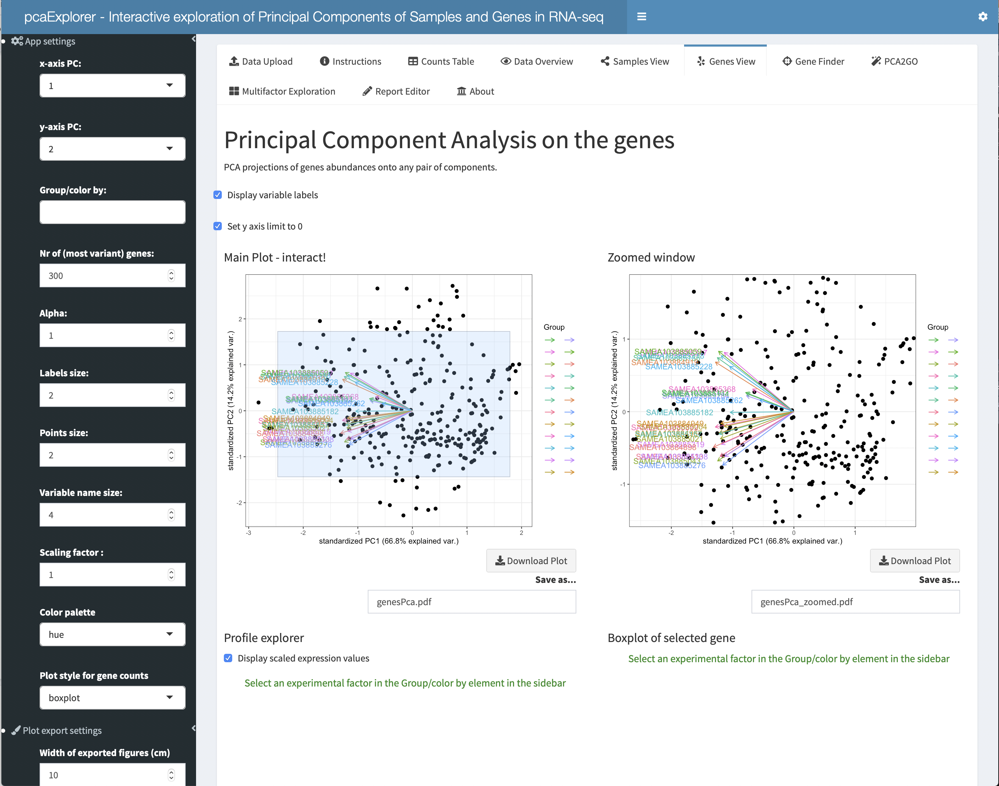

16. In the 'Zoomed window' select a gene by clicking on one of the black dots. 
This will generate a box plot under the 'Boxplot of selected gene' heading (Fig. X). 
The plot will show the normalized counts for the selected gene. 
In the shown example, the individual boxes of the plot will visualize the normalized counts in each condition as this option is selected as 'Group/color by'. 
You can also change the style of the plot to a violin plot. To change the plot, search for the 'Plot style for gene counts' option in the option bar on the left. 
Click on the option and select 'violin plot' from the drop-down menu. 
The box plot should change to a violin plot. 
Both plot versions can be downloaded by clicking on the 'Download plot' button in the lower right corner of the plot. 
Below 'Save as...' you can specify the file name of the saved plot. 


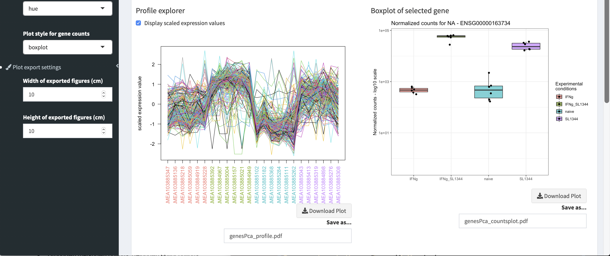

17. Scroll down in the Genes View panel. 
Below the 'Profile explorer' and 'Boxplot of selected gene' plot you will find heatmaps of the genes in the individual samples (Fig. X). 
On the left you will find a static version of the heatmap while the version on the right is interactive. 
You can use the symbols in the upper right corner of the plot to interact with the plot. 
To identify the different purposes of the individual buttons, hover over each button. 
Upon hovering over the buttons, small explanations of the buttons will appear. 

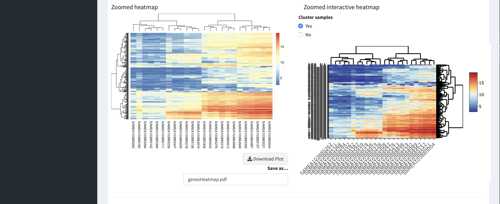
18. Navigate to the GeneFinder panel (Fig. X, **TODO: Grafik erstellen**). 
In the 'Type in the name of the gene to search' option field type 'TSPAN6'. 
Select the option condition on the left in the 'Group/color by' field (see above for exact procedure **TODO: list exact steps here**). 
The panel will load a box plot of the normalized counts of the selected gene as well as a table with the normalized counts of the gene for each sample.

    *The Gene Finder panel can be helpful in identifying the counts of a specific gene of interest in the individual samples. 
    If the gene of interest is not included in the data, the panel will inform the user by displaying the error message 'Could not find the gene you typed'. 
    The panel will also inform users if the gene name is misspelled and will suggest a gene name close to the typed one. 
    The search functionality is case sensitive and has no autocomplete option, so it is important to type the gene name correctly. *

19. Navigate to the PCA2GO panel (Fig. X, **TODO: Grafik erstellen**). 
Click on the 'Select species for your sample' option. 
From the drop-down menu select 'human'. 
The 'Select the input type of your identifiers' option can remain unaltered. 
Check the 'Display compact tables' option and click the blue 'Compute the PCA2GO object' button. 
The application  might take a while to compute the object. 

    **TODO: Something about the final object** 

20. Navigate to the Report Editor panel (Fig. X, **TODO: Grafik erstellen**). 
Open the 'markdown options' drop-down menu by clicking on the plus sign in the blue 'markdown options' box. 
As title for the report enter 'Current Protocols pcaExplorer report' and your name in the 'Author' field.
Leave all other options unaltered. 
Close the drop-down menu by clicking on the minus sign in the blue 'markdown options' field. 
Click the 'Update report' button. Scroll won in the panel to see an overview version of the report. 
Click on the 'Generate & Save' button next to the 'Update report' button to download the report. 
Save the report under a chosen name on your computer. 

21. Navigate to the About panel (Fig. X **TODO: Grafik erstellen**). 
This panel includes general information on pcaExplorer as well as the developers contact information. 
The 'About' panel can also be useful for reproducibility as the sessionInfo is also reported in the panel.

22. Navigate to the Instructions panel through clicking on the panel name in the panel list at the beginning of each panel (Fig. X). 
Open the vignettes of pcaExplorer by clicking on the two buttons 'Open the User Guide (main vignette)' and 'Open the 'UP and Running' vignette'. 
This will open the two vignettes of pcaExplorer in your selected default browser. 
The vignettes describe the individual panels of pcaExplorer in detail and provide walkthroughs on how to explore input data with pcaExplorer. 
Users are recommended to read the vignettes to fully grasp the different possibilities provided with pcaExplorer.

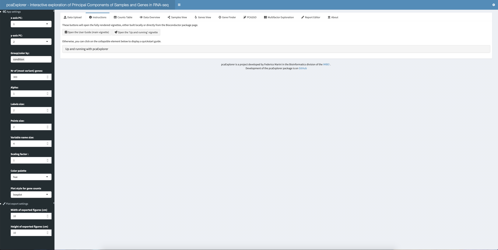


# Session information {-}

```{r}
sessionInfo()
```

# References {-}
