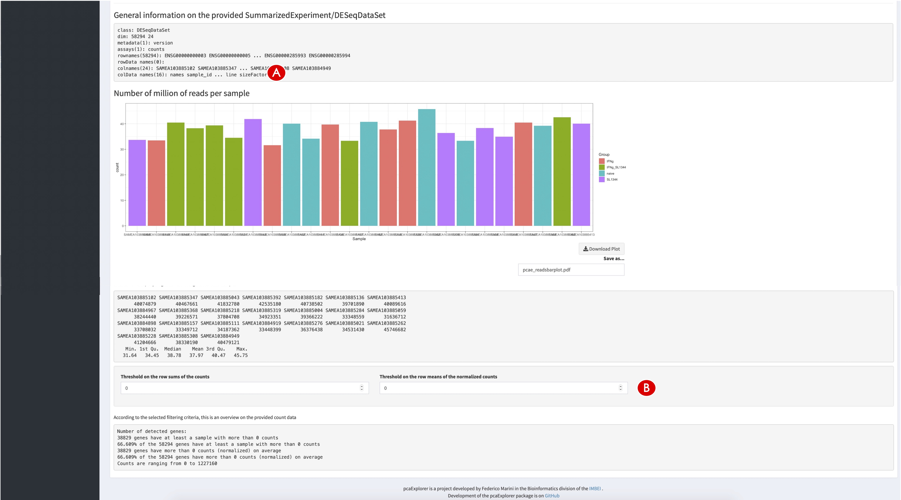

**Compiled date**: `r Sys.Date()`

**Last edited**: `r Sys.Date()`

```{r setup, include = FALSE, cache = FALSE, eval = TRUE, echo = FALSE}
library(knitr)
opts_chunk$set(
  fig.align = "center",
  fig.show = "asis",
  eval = TRUE,
  fig.width = 10,
  fig.height = 7,
  tidy = FALSE,
  message = FALSE,
  warning = FALSE,
  size = "small",
  comment = "##",
  echo = TRUE,
  results = "markup"
)
options(replace.assign = TRUE, width = 100)
```

```{r loadLibraries, results= "hide", eval=FALSE}
library("DESeq2")
library("topGO")
library("org.Hs.eg.db")
library("pcaExplorer")
library("ideal")
library("GeneTonic")
```

# Introduction

`pcaExplorer` is a Bioconductor package [@Marini2019] which can be used as a general-purpose interactive companion tool for RNA-seq analyses, developed in the Shiny framework [@Shiny2021]. `pcaExplorer` is designed to guide the user in exploring the Principal Components (PC) latent space [@Jolliffe2002] of the data under inspection. Besides the Principal Component Analysis (PCA), `pcaExplorer` also provides tools to detect outlier samples and inspect their impact, identify genes that show particular patterns of interest, and additionally provides a functional interpretation of the principal components for further quality assessment and hypothesis generation on the input data.

In this protocol, we describe how to launch an instance of `pcaExplorer` working with the data of the macrophage dataset [@Alasoo2018], which is also distributed as a Bioconductor package [@Huber2015].

# Necessary Resources

*Hardware*

* See detailed description in Support Protocol 1.

*Software*

* See detailed description in Support Protocol 1.

*Files*

* See detailed description in Support Protocol 1. Specifically, this Basic Protocol will make use of:
  * The count matrix file, containing the expression values for the `macrophage` dataset (`countmatrix_macrophage.txt`)
  * The file containing the information on the experimental covariates (`metadata_macrophage.txt`)
  * The annotation file (`annotation_macrophage.txt`), for handling the conversion between ENSEMBL identifiers and gene symbols.
  The alternative entry points specified in this Basic Protocol also use some processed form of the text files listed above to generate the `dds` and `dst` objects (see Step 2 below), ensuring that this procedure is fully reproducible (see Fig. 1A for a visual summary).
  
```{r fig1}
#| echo = FALSE,
#| fig.cap = "**Figure 1** - Workflow schematic for the presented protocols (A). The different data formats to provide to each of the protocols are represented as tabular or list-like elements, named by the scheme followed in the procedures illustrated in this work. Dashed arrows indicate that the provided information can be used to generate or annotate another object. Solid arrows (grey) denote that an object has been derived/computed from the other where the connector originated from. The small boxes close to each element explain in which protocol each object is used as primary (black) or secondary (grey) input. On the right side, the two main approaches delivered by our software (interactivity via web applications and reproducibility via reporting) are represented. A summary of the tasks each protocol accomplishes is detailed in (B) – linked together from the setup and installation, all the way down to the data interpretation."
knitr::include_graphics("figures_manuscript/msfigure_01.jpg")
```


# Protocol Steps with Steps Annotations

Before we start with the exploration of the data, the necessary packages and dependencies need to be installed and loaded. Support Protocol 1 describes how to install and load the packages.

**Exploring the data with `pcaExplorer`**

1.	Prepare the input data for `pcaExplorer`.  
    The main `pcaExplorer()` function requires the count matrix, the metadata, and annotation (Fig. 1A, black small boxes labeled BP1) to be either loaded into the environment before the main call, or offers the possibility to load these objects during runtime (which can be common for a first execution). If loading the input files at runtime, the application can be launched with the simple command, leaving all other parameters unspecified.
  
    ```{r eval=FALSE}
    library("pcaExplorer")
    pcaExplorer()
    ```

    To launch the application, enter the command into the console of RStudio and press the Enter key. This will open a new window with the `pcaExplorer` application. In this application you should see the Data Upload panel as shown in Fig. 2, with examples on the file formats expected to be working correctly in the app (see inset in Fig. 2D).  
    In this case, upload one by one the count matrix file, the sample metadata file, and the annotation file as provided in the ‘Input_file’ folder of the protocols repository (see Support Protocol 1) – Fig. 2 reflects the content displayed if launching the application as specified above.  
    If the necessary objects are already loaded in R (e.g. with any function that reads tabular text input), you can launch the Shiny application with the command:

    ```{r eval=FALSE}
    library("pcaExplorer")
    pcaExplorer(countmatrix = countmatrix, 
                coldata = metadata, 
                annotation = annotation)
    ```

    In this call, `countmatrix`, `metadata` and `annotation` have to be substituted by the names of the respective objects. 

```{r fig2}
#| echo = FALSE,
#| fig.cap = "**Figure 2** - Overview of the Data Upload panel in pcaExplorer. Upon providing the count matrix and the metadata as specified in step 1, it is possible to generate the internally required objects (A); different transformations can be applied to the expression matrix (B), and all provided objects can be previewed clicking on the buttons below (C). Inset (D): some examples of the accepted formats to upload for the count matrix, the experimental metadata, and the annotation file."

```

2.	Generate the necessary objects for using `pcaExplorer`.  
    Click the ‘Generate the dds and dst object’ button (Fig. 2A). The `dds` object represents a `DESeqDataSet` dataset object, while the `dst` is a `DESeqTransform` object [@Love2014].  
    Both objects are needed for the exploration of the data, and can be readily derived from the provided files/objects – alternatively, you can pass directly the `dds` and the `dst` objects (Fig. 1A, grey small boxes labeled BP1), in case they are already loaded in the R environment (e.g. while running an analysis from the command line). This is possible with the lines of code reported here:

    ```{r eval=FALSE}
    library("pcaExplorer")
    pcaExplorer(dds = my_dds,
                dst = my_dst)
    ```

    After the generation of the two objects, the ‘Select one of the following transformations for your data:’ option with three blue colored buttons underneath should appear in the panel. Click the ‘Compute variance stabilized transformed data from the dds object’ button on the left (Fig. 2B).  
    `pcaExplorer` provides three different options for data transformation. The first option is to compute a variance stabilized transformed version of the data. The second is a regularized logarithm transformation of the data. A log2 data transformation is also offered. Users are advised to choose the data transformation according to their input data and evaluate the effects of the different transformations on their data.

3.	Preview the provided input data.  
    Scroll to the bottom of the Data Upload panel, where a preview of the input data is provided. You can access each of the data components by clicking on the green colored buttons (see Fig. 2C) - each of these opens up a separate modal window.

4.	Explore in detail the provided counts table.  
    Navigate to the Counts Table panel, by clicking on the panel name in the tabs list at the top of the main body of the application (Fig. 3A). In this panel, the information of the count matrix is shown in a table. A dropdown menu at the beginning of the panel (Fig. 3B) provides the possibility to change the displayed expression table (including raw counts, normalized counts, regularized logarithm transformed counts, etc.). You can download these different versions of the original counts table through clicking on the green download button below (Fig. 3C).

```{r fig3}
#| echo = FALSE,
#| fig.cap = "**Figure 3** - Overview of the Counts Table panel in pcaExplorer. The navigation to this panel occurs by clicking on the respective name on the top of the tabs (A). The selection of the displayed expression table is done with the dropdown element (B), and the content of the table can be downloaded by clicking on the download button (C). The correlations between samples can be explored in the section below (D), where additional content can be generated (e.g. a scatter plot matrix and a heatmap, to appear at (E))."

```


5.	Explore the correlations between samples.  
    Scroll down until you see the ‘Sample to sample scatter plots’ heading (Fig. 3D). Choose ‘pearson’ as correlation method from the ‘Correlation method palette’. If you want to reduce the computation and rendering time, check that both options ‘Use log2 values for plot axes and values’ and ‘Use a subset of max 1000 genes (quicker to plot)’ are selected. Click on the ‘Run’ button to generate the scatter plots (appearing below Fig. 3E) – this includes a scatter plot matrix and a heatmap describing the correlation between all pairwise sample combinations.
Creating an overview and computing summaries on the provided data.

6.	Explore the relationships between the samples.  
    Navigate to the Data Overview panel (Fig. 4). The panel shows the input metadata as a table in the upper section of the user interface, with some interactive features to edit its appearance or to search its content (Fig. 4A). Below the metadata table, a Sample to Sample distance heatmap can be found, representing the distances between the individual samples. The ‘Select the distance method to use’ option (Fig. 4B) enables you to change the underlying distance method used for the computation. Furthermore, you have the option to download the heatmap via the ‘Download Plot’ button in the lower right corner below the heatmap. In the field ‘Save as…’ you can specify the name of the file to save the heatmap to (Fig. 4C) - this functionality is provided for any graphical output presented in `pcaExplorer`.
    
```{r fig4}
#| echo = FALSE,
#| fig.cap = "**Figure 4** - Overview of the Data Overview panel in pcaExplorer. The metadata information is presented in the table (A), and a heatmap can be computed based on the selected distance method (B) and displayed. This visual overview can be downloaded by clicking on the button below it (C). The “Group/color by” selector controls the graphical aspect of the output, related to the experimental covariates of interest (D)."

```


7.	Decorate the plots by encoding information on the experimental covariates.  
    Below the heatmap, this panel provides some further information about the input data (Fig. 5A). Next, color the sample by their originating cell line. To color the samples by this covariate, click on the ‘Group/color by’ field (Fig. 4D) in the grey side bar at the far left of the screen. Scroll down in the dropdown menu which opens upon clicking until you find the ‘line’ option - or leverage the autocompletion functionality and start typing the initials. Once any option is selected, scroll down to the ‘Number of million of reads per sample’ plot. This plot should have changed from an all grey plot to a colored plot (Fig. 5A).  
    In the provided sample data, the ‘line’ parameter indicates the cell line of the respective sample. The Number of million reads per sample plot shown in Fig. 5A can be used to evaluate the uniformity of reads in each sample. Samples with a surprisingly high or low number of reads could later be detected as outliers, because of several different factors associated with the number of reads in a sample. An inspection of the distribution of the overall number of reads in the individual sample can point users to the first source of differences in the samples found in subsequent analyses of the data (e.g. as described in Basic Protocol 2 and 3).

```{r fig5}
#| echo = FALSE,
#| fig.cap = "**Figure 5** - Further content of the Data Overview panel in pcaExplorer. Some general information is shown in the barplot about the assigned number of reads (A), while filtering options for defining genes as expressed are displayed in the lower section (B)."

```


8.	Change the selected experimental covariates of interest.  
    Scroll up again until you see the ‘Group/color by’ option (Fig. 4D), which constitutes an efficient way to explore different experimental covariates of the data and providing context to individual plots and results. Delete the selected option by clicking on the white rectangle and hitting the delete key on your keyboard until the field is empty again. From the dropdown menu of options, select ‘condition’ as next parameter to color by. Instead of selecting ‘condition’ from the dropdown menu directly you can also select the option by typing it into the white rectangle. This widget controls the appearance of many plots in `pcaExplorer`, and is used to encode the grouping information (or their combinations).

9.	Compute some summary statistics on the provided data.  
    Scroll down to the ‘Basic summary for the counts’ heading. Here you will see the total number of uniquely assigned reads per sample, accompanied by some information about the expressed genes in the data, specified via simple thresholds. The first option is provided through setting the ‘Threshold on the row sums of counts’ option. To test this option, enter 10 in the dedicated field and compare the results to the ones shown in Fig. 5B. The second option to analyze the genes in the data is the ‘Threshold on the row means of the normalized counts’ option (generally stricter than the former definition). Enter 10 for this option and compare the results with the ones shown in Fig. 5B.

**Exploring the Principal Components from the samples point of view.**

10.	Create a Principal Component plot.  
    Navigate to the Samples View panel (Fig. 6). In this panel you will see the PCA of the individual samples of the input data on the left side, with the corresponding scree plot shown on the right side. If any value is selected in the ‘Group/color by’ field (Fig. 6A), you can explore the impact of each covariate by means of the color encoding applied to the graphics. Use the ‘Group/color by’ option to color the samples by condition - the PCA plot should now display the samples in four colors (Fig. 6C). You can also download the PCA plot via the ‘Download plot’ button in the lower right corner; as seen before, you can specify the name of the file to which you want to save the plot. This is also possible for the scree plot on the right side of the panel.  
    The PCA plot of the sample data indicates that the most variance in the data seems to arise from the condition of the individual samples in this specific data set. When analyzing data, it is important for users to know which experimental variables of their samples have the most influence (i.e. are responsible for the most of the variance). Hence, you should select different options from the ‘Group/color by’ option to discover the covariate with the most influence. This is also important for any downstream analyses, including the differential expression analysis described in Basic Protocol 2. The scree plot right next to the PCA (Fig. 6D) can also help you to evaluate how many principal components should be used to analyze the variance in the data. In the example shown in this protocol, it can be easily observed that the first two components explain nearly 80% of the variance in the data. 80% can be seen as a good cut-off value to select the number of principal components.

```{r fig6}
#| echo = FALSE,
#| fig.cap = "**Figure 6** - Overview of the Samples View panel in pcaExplorer. Upon selection of the experimental covariate of interest (A) and the number of most variable genes to use in the computation (B), the aspect of the PCA plot (C) is expected to change, together with the scree plot on its side (D). Users can zoom in this plot by brushing areas, and this displays a magnified version below (E). For the selected principal components, genes with the highest absolute loadings are also displayed in a barplot (F)."

```

11.	Change the parameters to display different versions of the PCA.  
    Navigate to the options panel on the far left and search for the ‘Nr. of (most variant) genes’ option (Fig. 6B), set as default to 300 genes. Change this number to 500 - either using the increase and decrease buttons in the option field (indicated by small arrows) or by typing the value in the box. Inspect the PCA plot and compare it with the plot in Fig. 6. The values of the percent of variance explained of the first and second principal component should have changed, and according to the values, you might observe slight differences in the placement and clustering of the samples (according to how the inclusion of a specific set of genes influences the overall variability).  
    The PCA plot visualizes the variance in the data and the differences between the individual samples. The number of genes selected for the PCA plot can influence the overall structure of the plot. In order to analyze which covariate is responsible for the variance in the data, you should also consider changing the number of genes used for the PCA. This enables you to analyze the robustness of the identified factor.  
    You can also change the principal components that are displayed on either axis: by default, PC1 and PC2 are shown, but this can be changed by the select widgets in the left sidebar. This can be extremely relevant when analyzing large datasets, where it is hard to identify a clean structure - in this Basic Protocol, the dimensions of variability are relatively straightforward to define and associated with experimental covariates.

12.	Zoom in the PCA plot.  
    The Sample View panel provides the possibility to zoom in on the PCA, using the Shiny brushing mechanism: hover your mouse over the PCA plot until your mouse cursor changes to a little plus sign. Click and hold the left mouse button to draw a little grey rectangle in the main plot (Fig. 6E). Move the mouse to the upper left corner of the PCA plot and select all samples belonging to the naive condition (colored in blue in Fig. 6C) as explained before. Below the main plot, you can find a zoomed version of the PCA plot, containing the selected samples. This should somewhat look like the plot shown in Fig. 6E. The zoom functionality is especially helpful in cluttered PCA plots with many samples or particular cluttered regions of the plot.

13.	Identify genes with high loadings on the selected principal components.  
    As a result to the computation of the principal components, the genes have a specific value for the loadings, reflecting the “weight” that each of them has on a particular principal component – this can be thought of as the correlation between the PC and the original variable. For the two selected principal components (by default, PC1 and PC2), the genes with highest loadings (in either direction along the axis of a PC) are displayed as bar chart (Fig. 6F), and can later be followed up, e.g. in the Gene Finder tab panel.

14.	Inspect the impact of marking samples as outliers.  
    Scroll down in the Sample View panel until you see the ‘Outlier identification’ option (Fig. 7A). The ‘Select which sample(s) to remove - suspected outliers’ option provides the possibility to select and remove individual samples from the PCA. For demonstration purposes select all samples of the ‘naive’ condition and remove them from the PCA (the sample ids end in ‘102,’ ‘111,’ ‘182,’ ‘262,’ ‘284,’ and ‘368’). The options included in the dropdown are the samples still used for the calculation. Select the above-mentioned sample ids until the PCA plot looks like Fig. 7A.  
    The sample outlier detection option can help users at identifying individual samples which are highly different from the remaining samples and hence could be possible outliers. Especially for data sets with small sample numbers, the outlier identification option is useful to evaluate the influence of individual samples on the overall PCA of the data.  
    At the bottom of the Sample View panel, you also have the option to select a third principal component to visualize besides the first two (Fig. 7B). This is especially helpful in data sets where the most variance of the data is scattered among several principal components and not only the first two.

```{r fig7}
#| echo = FALSE,
#| fig.cap = "**Figure 7** - Further content of the Samples View panel in pcaExplorer. Outlier identification can be assisted by selecting the samples to remove from the computation (A). A third dimension can be added for exploration in the 3D interactive PCA plot (B)."

```

**Exploring the Principal Components from the genes point of view.**

15.	Create the genes biplot.  
    Navigate to the Genes View panel (Fig. 8), where you will see the results of a PCA on the individual genes as a dual view to samples PCA from the previous steps (Fig. 8A). Again, you can select a section of the plot to zoom which will be shown on the right side in the ‘Zoomed window’ (Fig. 8B, 8C). Upon selecting a subset of genes in the main plot, these will also be displayed in the profile explorer as scaled expression values - a value needs to be selected in the ‘Group/color by’ selection, and you can continue using the ‘condition’ as in the previous steps (Fig. 8D). Each line in the profile explorer represents a gene, and the connection between the data points help to follow the relationship across samples. 

```{r fig8}
#| echo = FALSE,
#| fig.cap = "**Figure 8** - Overview of the Genes View panel in pcaExplorer. A PCA focused on the gene is shown (A), and upon interaction (brushed area, B) it is magnified in the zoomed section (C). A profile explorer (D) is shown for the selected genes across the samples, and if a gene is clicked upon in the zoomed area, its expression values are plotted (E). Static (F) and interactive (G) heatmaps on the selected subsets are reported in the bottom section."

```

16.	Inspect single selected genes.  
    In the ‘Zoomed window,’ select a gene by clicking on one of the black dots. This will generate a box plot under the ‘Boxplot of selected gene’ heading (Fig. 8E), showing the normalized counts for the selected gene, with the conditions defined by the value in the ‘Group/color by’ selector. You can also change the style of the plot to a violin plot. To change the plot, search for the ‘Plot style for gene counts’ option in the option bar on the left.

17.	Inspect subsets of selected genes.  
    Below the ‘Profile explorer’ and ‘Boxplot of selected gene’ plot you will find two versions of the heatmap for the selected genes (displayed in the zoomed window) in all the individual samples (Fig. 8D) - one static (Fig. 8F) and one interactive, based on the Plotly framework (Fig. 8G). On the bottom, the collapsible element ‘Table export options’ contains the tabular information for the same subset, and offers the possibility to export their content.

18.	Inspect genes of interest in the Gene Finder.  
    Navigate to the Gene Finder panel (Fig. 9). Enter ‘TSPAN6’ in the ‘Type in the name of the gene to search’ option field (Fig. 9A). Make sure that ‘condition’ is still selected in the ‘Group/color by’ option; otherwise, select it from the available option. The panel will load a box plot of the normalized counts of the selected gene (Fig. 9B) as well as a table with the normalized counts of the gene for each sample (Fig. 9C). The individual sample names are annotated on the plotted points, and the underlying data is also reported as a compact table.  
    The Gene Finder panel can be helpful in identifying the counts of a specific gene of interest in the individual samples. If the gene of interest is not included in the data, the panel will inform you by displaying the error message ‘Could not find the gene you typed’. The panel will also try detecting if the gene name is misspelled and will suggest a gene name close to the typed one. The search functionality is case sensitive and has no autocomplete option, so it is important to type the gene name correctly.

```{r fig9}
#| echo = FALSE,
#| fig.cap = "**Figure 9** - Overview of the Gene Finder panel in pcaExplorer. The search field (A) toggles the selection of individual genes, displayed graphically (B) and in tabular format (C)."

```

19.	Generate a functional interpretation for the principal components.  
    Navigate to the PCA2GO panel (Fig. 10). Click on the ‘Select species for your sample’ option (Fig. 10A), and from the dropdown menu select ‘Human’ (Fig. 10B). The ‘Select the input type of your identifiers’ option can remain unaltered, as we are already using ENSEMBL identifiers; if this is not the case in your own data, make sure to check what identifiers are in use, and select them accordingly. Click the blue ‘Compute the PCA2GO object’ button (Fig. 10C), the application will compute for each PC and for each direction a set of enrichment results - it might take a while to compute the object. Each enrichment table will be displayed on either side of the PCA plot in the middle of the panel (Fig. 10D), and can be used to pinpoint biological processes and functions that can explain the observed variability on the latent space representation.  
    Optionally, to save time and obtain more fine-grained functional categories, you can compute such an object beforehand with methods implemented in the `topGO` package [@Alexa2006], which are conveniently wrapped by the `pca2go()` function. We refer to the package vignette where its specific usage is fully documented.

```{r fig10}
#| echo = FALSE,
#| fig.cap = "**Figure 10** - Overview of the PCA2GO panel in pcaExplorer. The species (A) and identifier types (B) can be selected at runtime, to generate the set of tabular results displayed below (C), decorating the respective axes of variation on the PCA plot (D)."

```
    
**Wrapping up the analysis with `pcaExplorer`.**

20.	Generate, preview, and export an analysis report.  
    Navigate to the Report Editor panel (Fig. 11). Open the ‘Markdown options’ dropdown menu (Fig. 11A), and enter as a title for the report ‘Current Protocols pcaExplorer report’ and your name in the ‘Author’ field; you can leave all other options unaltered (Fig. 11B). Click the ‘Update report’ button, and scroll down in the panel to see a preview of the HTML report in the web application itself. Click on the ‘Generate & Save’ button next to the ‘Update report’ button (Fig. 11C) to download the report. Save the report under a chosen name on your computer – this operation might take a while, as most content is generated from a fresh session, based on the current values for the reactive elements in the app.

```{r fig11}
#| echo = FALSE,
#| fig.cap = "**Figure 11** - Overview of the Report Editor panel in pcaExplorer. Options for markdown (A) and the editor (B) are shown in the top section. Below, the report is previewed in the page, with the possibility to swap to view and update its source code (C)."

```

21.	Export the analyses components for further downstream exploration.  
    You can open the Tasks menu from the small cogs icon in the top right of the header (Fig. 12A). From there, it is possible to export the state of the app’s reactive elements into a binary .RData workspace, or also store their values directly into an environment - this will close the app as a result; the workspace can be retrieved in the R session by calling `pcaExplorer_env`, containing a list of values for the input widgets and the reactive elements.

```{r fig12}
#| echo = FALSE,
#| fig.cap = "**Figure 12** - Overview of the Instructions and About panels in pcaExplorer. Like from any other panel, it is possible to open the task menu from the small cogs icon (A). In the Instructions panel, the vignettes can be consulted while running the app (B). The About page (C) contains information on the development team and how to cite the package."

```

22.	Find additional information on `pcaExplorer`.  
    Navigate to the Instructions panel, where two buttons can be clicked to open and inspect the `pcaExplorer` vignettes (available when installing the package) (Fig. 12B). These vignettes describe comprehensively the `pcaExplorer` package, and constitute an excellent complement to this Basic Protocol when searching for additional, up-to-date documentation. A quickstart guide is also displayed if clicking on the ‘Up and running with `pcaExplorer`’ collapsible element. If you are interested in additional information about the package, the About panel (Fig. 12C) lists also the developers contact information and a citation entry. For the sake of computational reproducibility, consider adding the output of the sessionInfo section into your electronic notebook documentation, to simplify the compilation of the ‘Materials and Methods’ section for a manuscript where you used `pcaExplorer`.


<hr>

# Session information {-}

```{r}
sessionInfo()
```

<hr>

# References

