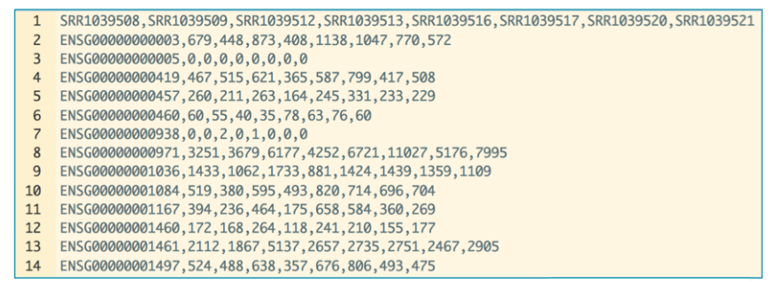

**Compiled date**: `r Sys.Date()`

**Last edited**: `r Sys.Date()`

```{r setup, include = FALSE, cache = FALSE, eval = TRUE, echo = FALSE}
library(knitr)
opts_chunk$set(
  fig.align = "center",
  fig.show = "asis",
  eval = TRUE,
  fig.width = 10,
  fig.height = 7,
  tidy = FALSE,
  message = FALSE,
  warning = FALSE,
  size = "small",
  comment = "##",
  echo = TRUE,
  results = "markup"
)
options(replace.assign = TRUE, width = 100)
```

# Loading required packages

```{r loadLibraries, results= "hide"}
library("DESeq2")
library("topGO")
library("org.Hs.eg.db")
library("pcaExplorer")
library("ideal")
library("GeneTonic")
```

# Introductory Paragraph

ideal [@Marini2020] is a Bioconductor package for the interactive analysis of RNA-seq data in the context of differential expression (DE) [@Oshlack2010, @Love2015]. 
ideal guides the user through the different steps of a DE analysis, starting from the data upload, through the `DESeq2` [@Love2014] workflow including normalization, filtering, exploration of differentially expressed genes, to functional analysis and gene signature exploration.

In this protocol we describe how to launch the ideal web application (also implemented in the Shiny framework [@shiny2021]), running on the macrophage dataset [@Alasoo2018], which is also distributed as a Bioconductor package [@Gentleman2004a, @Huber2015]. 

# Necessary Resources

*Hardware*

  See detailed description in Support Protocol 1
  
*Software*

  See detailed description in Support Protocol 1
  
*Files* 

  ideal mainly requires 4 input files in text format or alternatively a `DESeqDataSet` or `DESeqResult` object.
  The tabular text files are expected to be tab-separated, but also comma- or semicolon-separated files are accepted. (see **Alternative protocol 1**). 
  The first input file is the count matrix, which stores the number of times (i.e counts) a certain feature (e.g. gene) has been assigned a sequencing read, over all samples. 
  In the count matrix, the samples are stored as columns, while each row contains an individual feature (see Fig. X).
  
  

  The second input of ideal is the metadata file. This file stores for each sample the necessary experimental variables. 
  The individual samples represent the rows of the file while the columns save the different experimental variables (see Fig. X).
  
  

  The third input of ideal is the optional but recommended annotation file. 
  The file contains the feature ids of the count matrix in the rows and at least one column called `gene_name` which contains a more human readable form of the feature ids (e.g. HGNC gene names [@Tweedie2021] if the features are stable gene identifiers such as ENSEMBL or GENCODE). 
  Fig. X shows an example of an annotation file.
  Notably, these three text files are identical in their format and content to the ones provided to pcaExplorer (see Basic Protocol 1); this unified set of requirements simplifies the usage of both tools.
  
  

  The last input of ideal is a list of gene sets, provided in the Gene Matrix Transposed (GMT) format, which is commonly used by online repositories, such as the [MSigDB database](http://software.broadinstitute.org/gsea/msigdb/index.jsp), or the [WikiPathways database](http://data.wikipathways.org/). 
  The GMT file format is a tab delimited file format of gene sets, where each row represents a gene set. 
  A gene set contains a gene set name in the first column, a description in the second column, and several genes in the remaining columns (one gene per column).



# Protocol steps

Before we start with the exploration of the data, the necessary packages and dependencies need to be installed and loaded. 
**Support Protocol 1** describes how to install and load the packages. 

**Starting up with the ideal package.**

1. Load the `ideal` package and start the `ideal` web application.
The input data can be provided in different ways to the `ideal` application. 
The first option is to provide the data as R objects to the function `ideal()`, as in the following chunk:

```{r eval=FALSE}
library("ideal")
ideal(countmatrix = countmatrix, 
      expdesign = metadata, 
      annotation_obj = annotation, 
      gene_signatures = genesignatures)
```

where `countmatrix`, `metadata`, and `annotation` have to be `data.frame` objects, and `genesignatures` has to be a list object. 

The second option is to provide the data as a `DESeqDataSet` object (optionally with a corresponding `DESeqResult` object, if already computed).
These classes are the core containers used in the framework of the DESeq2 package [@Love2014].

```{r eval=FALSE}
library("ideal")
ideal(dds_obj = dds,
      res_obj = res_de)
```

For users less familiar with a command line interface, a third option is available, where one can interactively upload the data as text files, directly in the `ideal` web application. 
For this option, launch the Shiny application with the R command `ideal()` without further arguments. 

```{r eval=FALSE}
library("ideal")
ideal()
```

All of these options should open a browser window with the `ideal` application, which will display the Welcome panel by default.


2. Explore the user interface of `ideal`.
When launching the dashboard, the landing page of `ideal` is the "Welcome" panel, providing the user information about the application and how to use it.
Users are invited to read up the material in the "Quick start for effective usage" section, and to familiarize with two of the mechanisms help is provided in the app, namely the collapsible elements (containing text based introductions) and the buttons to start guided tours of the interface.
A sidebar is located on the left side of the user interface, and contains several input controls which affect different tab panels. 
By changing one or more of the input parameters, the user can define what is computed by the app, and how these output elements are displayed.
Moreover, the sidebar contains a "Quick viewer", showing an overview of the underlying objects, required to perform all of the analyses offered by `ideal` - a green check icon appears close to each item, when the respective component is either provided or calculated.
A compact summary of the main objects is also provided in the value boxes, in the top section of the body of the app.

3. Setup the data for the analysis in `ideal`.
Navigate to the panel "Data setup". 
Inspect or upload interactively the required count matrix, and the experimental design data in the "Step 1" box, marked by the red color. 
If uploading from text files, click on the respective buttons and select the files where this information is stored - make sure the encoding format is respecting the expected requirements for working in the ideal application.

4. Specify the experimental design for the analysis.
In the "Step 2" box, marked in yellow, you can select the experimental design; specify `line` and `condition` for the `macrophage` dataset, and click on the green action button ("Generate the dds object"). 
This specification will enable you to estimate the effect size of the "condition" variable, while controlling for the "cell" line of origin, leveraging the flexible generalized linear model framework [@Anders2013].
If you desire to understand more about more complex model specifications, which might be possible depending on the structure of your data, we recommend to use tools such as ExploreModelMatrix [@Soneson2020] for this purpose.
Upon generation of the `DESeqDataSet` object, the respective value box on top turns green, and also the sidebar field for it will get a green check mark.

5. Add a gene annotation, and exclude samples from the analysis if required (optional).
The two light blue boxes that have appeared provide the optional steps for adding the appropriate annotation and discarding unwanted samples (e.g. if your initial data exploration revealed the presence of an outlier). 
If you did not pass an annotation at application start, select `Human` as species for the macrophage dataset, `ENSEMBL` as the id type [@howe2021ensembl], and confirm the selection with the blue button "Retrieve the gene symbol annotation for the upload data".
Once this is terminated, the value box for the annotation object is displayed in green.

6. Run the differential expression analysis.
Finally, run the main function of the `DESeq2` framework in Step 3 (green box) by pushing the button "Run DESeq".
If multiple cores are available, you can use the slider input to select the number of CPUs to use for speeding up the computation.
Once this is completed, you can inspect the mean-dispersion plot as a diagnostic check by expanding the collapsible element below.


**Exploring the count matrix and the differential expression result table.**

7. Inspect (and filter) the expression count matrix. 
Navigate to the panel "Counts Overview", which provides an interactive table, which can display raw, normalized, and log-normalized values for all the genes and samples in the data. 
A summary for the expressed features is reported below - you can set a threshold for either criterion to filter out the lowly expressed genes. 
This can also reduce the computation time without impacting the quality of the results. 
Filter the macrophage data with a threshold of zero on the row sums of the counts by pushing the "Filter the DDS object" button. 
Generate and inspect the sample-to-sample scatterplot matrix below which shows the similarity across all individual samples without losing the information on the single features - this can be quite useful for detecting unexpected patterns for subset of genes [@Rutter2019].


8. Compute the differential expression results.
Navigate to the "Extract results" panel to compute and explore the results for the differential expression analysis. 
Set the alpha level for significance to control the False Discovery Rate in the sidebar; for the macrophage data we can leave the value set to the default (0.05). 
This Basic Protocol focuses on the comparison between the Interferon-gamma treated cell line (`IFNg`) versus the untreated one (`naive`). 
Therefore, first select `condition` as the experimental factor to build the contrast upon. 
Then select `IFNg` as the numerator level, and `naive` as the denominator level for the fold change. 
Further options are provided to the user, where independent filtering or the Independent Hypothesis Weighting (IHW) can be defined [@Bourgon2010,@Ignatiadis2016]. 
After clicking on "Extract the results" we can see that in the macrophage dataset more than 6000 genes have been detected as differentially expressed for the `IFNg` treatment vs naive contrast.
Additionally, the value box for the DE genes is updated and displayed in green.
IRF1, IL18BP, and GBP2 are listed in the table below as the top regulated genes, sorted by their adjusted p-values. 
The interactive table directly links the gene symbols and the ENSEMBL identifiers to external databases for that feature, either [ensembl.org](https://www.ensembl.org/index.html) or the [NCBI Gene DB](https://www.ncbi.nlm.nih.gov/gene). 


9. Inspect the four diagnostic plots for the extracted DE results. 
The top left and right plots show raw p-value histograms, useful for checking the assumption of uniform distribution under the null hypothesis, also stratified by mean expression value (relevant if one is using the Independent Hypothesis Weighting for adjusting the p-value). 
The bottom left Schweder-Spjøtvoll plot [@schweder1982plots], shows the ranked p-values: this is a graphical method to illustrate the Benjamini-Hochberg multiple testing adjustment procedure, with the intersection point defining the subset of genes for which the False Discovery Rate (FDR) is controlled at the chosen level.
The bottom right plot is a histogram of the log2 fold change values, to show its distribution and identify anomalies such as highly skewed tails. 


**Exploring overviews of the results and single genes of interest.**

10. Generate overview visual representation of the DE results.
Navigate to the "Summary Plots" panel to generate a set of visual summaries of the results. 
Select in the MA plot (log2FoldChange vs mean expression values) some of the upregulated genes by brushing on the area that includes them. 
A zoomed-in version of the MA plot focused on the selected area will appear on the right side, providing labeling by gene symbols if these are defined in the annotation object. 

11. Inspect single genes upon interacting with the MA plot panel.
Click on a gene in the zoomed selection plot. 
If the "Group/color by" widget in the sidebar has a selection active (defaulting to the experimental factor of interest specified in the contrast), this action will display a box plot for the expression values in all conditions, and additional info retrieved from the Entrez database. 
In the middle section, you can view the results as a volcano plot, where the significance is directly plotted against the effect size (and direction). 
In addition, the subset of genes included in the rectangular selection is also displayed as heatmaps (both static and dynamic). 
Tabular information on the selected genes can be further exported from the collapsible element at the bottom of the tab panel.


12. Inspect single genes upon manual selection.
Navigate to the panel “Gene Finder” and explore a subset of genes of interest. 
In this protocol we will define the genes `CCL5`, `IFNGR1`, and `CXCL11` as genes of interest in the sidebar.
The tab panel displays up to four gene expression box plots for the selected genes, and also displays an MA plot where the shortlisted genes are annotated. 
The table containing all relevant values for the genes included in the selector widget can be explored in the collapsible element, and downloaded as text file.
To avoid manually selecting many genes (from the selectize widget in the sidebar), one can also upload a list as a plain text file, specifying one feature per row; these will be annotated in an alternative version of the MA-plot, and the corresponding table is provided below it.


**Performing functional enrichment analyses on the data and exploring gene signatures.**

13. Calculate overrepresented Biological Processes in the set of differentially expressed genes.
Navigate to the "Functional Analysis" tab to perform a gene set enrichment analysis on the differentially expressed genes, with the aim of gaining insight on the affected biological pathways. 
In the "Select the GO category(ies) of interest", make sure that `GO Biological Process` is included; alternative ontologies comprise `GO Molecular Function` and `GO Cellular Component`.
The functional enrichment analyses can be performed on different sets of genes: only the upregulated ones (tab panel "UPregu"); only the downregulated ones (tab panel "DOWNregu"); including both up- and downregulated genes (tab panel "UPDOWN"); any custom list of genes (in the two panels "List1" and "List2").
Navigate to the "UPDOWN" tab panel to perform the gene set enrichment analysis on the up- and downregulated features.
Three methods of overrepresentation analysis (ORA) are implemented in ideal: 1. The standard ORA based on the `limma` package [@Ritchie2015], 2. the `goseq` ORA, which accounts for the specific length bias intrinsic in RNA-Seq assays (longer genes have higher chances of being called DE) [@Young2010], and 3. the `topGO` ORA, which decorrelates the Gene Ontology graph structure and is particularly valuable for pruning terms which are topologically less meaningful than their specific nodes[@Alexa2006].
Perform the analysis with `topGO`, by clicking on the button called "Perform gene set enrichment analysis in the up- and downregulated genes - topGO".

14. Explore the results of the enrichment analysis.
As a result of the previous step, an interactive downloadable table appears, listing the relevant GO terms and the enrichment-relevant features, including e.g. the list of the differentially expressed genes annotated to each of the reported GO terms.
Click on the blue button of the GO term `GO:0060333` (interferon-gamma-mediated signaling pathway) to get further information from the [AmiGO](http://amigo.geneontology.org/amigo) database. 
If clicking anywhere in the row of the enriched GO term, a heatmap is displayed, showing the normalized and transformed expression values for the subset of DE genes assigned to each term, making it easy to inspect the overall regulation of a selected signature.
In the bottom section of this page, the subsets of genes that could have been used for computing enrichment results can be provided as input for a simple overlap analysis, by means of a Venn diagram and of an upset plot (particularly useful when including large number of sets).


15. Explore the expression profiles of gene signatures.
Navigate to the "Signature Explorer" panel and upload the `h.all.v7.0symbols.gmt` file retrieved from the [MSigDB database](http://software.broadinstitute.org/gsea/downloads.jsp) (please refer to the **Alternative protocol 1** for further detail on downloading the file). 
The green info box in the middle of the panel will report the number of signatures contained - in this case, the 50 hallmark signatures are present in the uploaded GMT file.
Compute the variance stabilized transformed data by clicking of the corresponding button.
To match the identifier types of your data with the signatures, select `ENSEMBL` as the ID type in your dds data, `SYMBOL` as the ID type of your signatures, and `org.Hs.eg.db` as the organism package for performing the match, by means of the "Apply id conversion between data and signatures" button.
In the lower section of the panel, select the gene signature of interest, e.g. `HALLMARK_INTERFERON_GAMMA_RESPONSE` and `condition` in the selection widget called "Select the colData to decorate". 
Optionally, use the check box below to include only the DE genes of the signature, filtering out the ones detected as non-significant.
A heatmap appears at the bottom of the panel, and can be further customized with the available checkboxes; mean centering (or even row standardization) are useful to simplify comparison across samples, while clustering options enable the detection of interesting groups of features.


**Wrapping up the analysis with ideal.**

16. Generate, preview, and export an analysis report.
Navigate to the panel "Report Editor" to generate and download a report of the analysis containing the current state of the parameters and generated images.
This functionality is shared with the pcaExplorer package, and is based on a comprehensive template report provided with the ideal package.
After selecting HTML as output format (and some general Markdown options), users can preview the report in the lower section of the panel.
Experienced users can edit the R Markdown of the report in the "Edit report" tab panel.
Once the report is finalized, click on "Generate & Save" to compile the document and store it on your system.

17. Export the analyses components for further downstream exploration.
Users can open the Tasks menu from the small cogs icon in the top right of the header.
From there, it is possible to export the state of the app's reactive elements into a binary .RData workspace, or also store their values directly into an environment - this will close the app as a result; this can be retrieved in the R session by calling `ideal_env`.
Clicking on the "Export as serialized SummarizedExperiment" button (in the Report Editor panel) will create a serialized rds object, where the essential content computed in the dashboard is coerced into a `SummarizedExperiment` object for further use, e.g. with iSEE [@Rue-Albrecht2018] for bespoke visualizations.
If enrichment results have been derived with topGO, it is also possible to export the whole as a GeneTonicList, making this object perfectly suitable to explore as described in Basic Protocol 3.


# Session information {-}

```{r}
sessionInfo()
```
`
