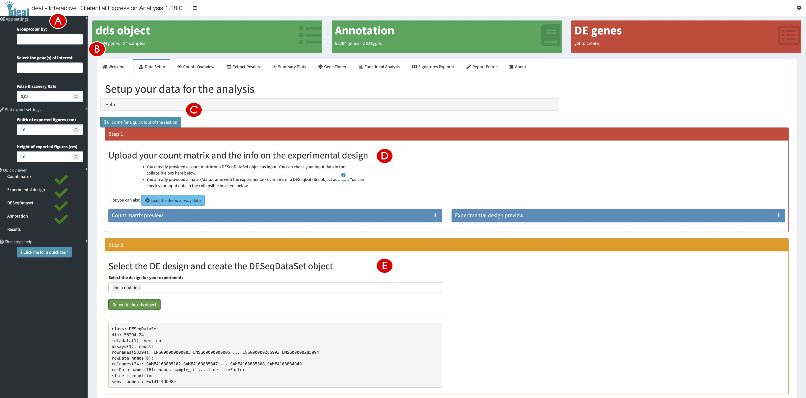
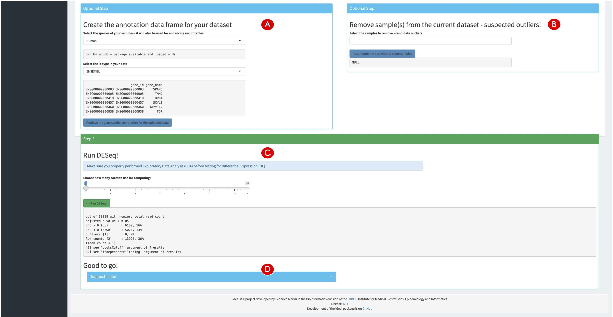
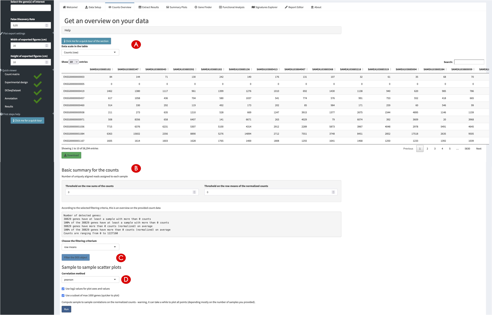
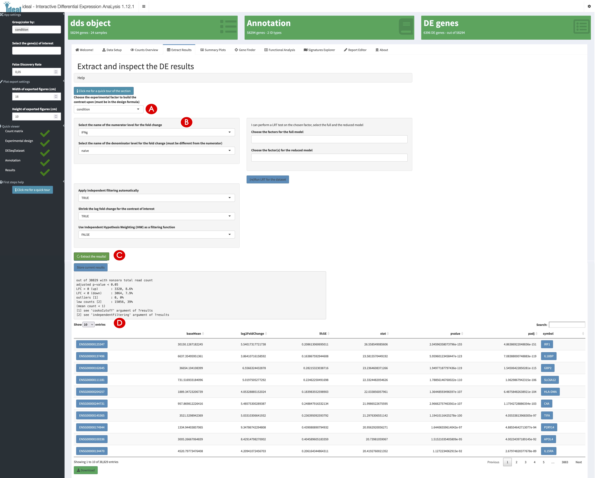
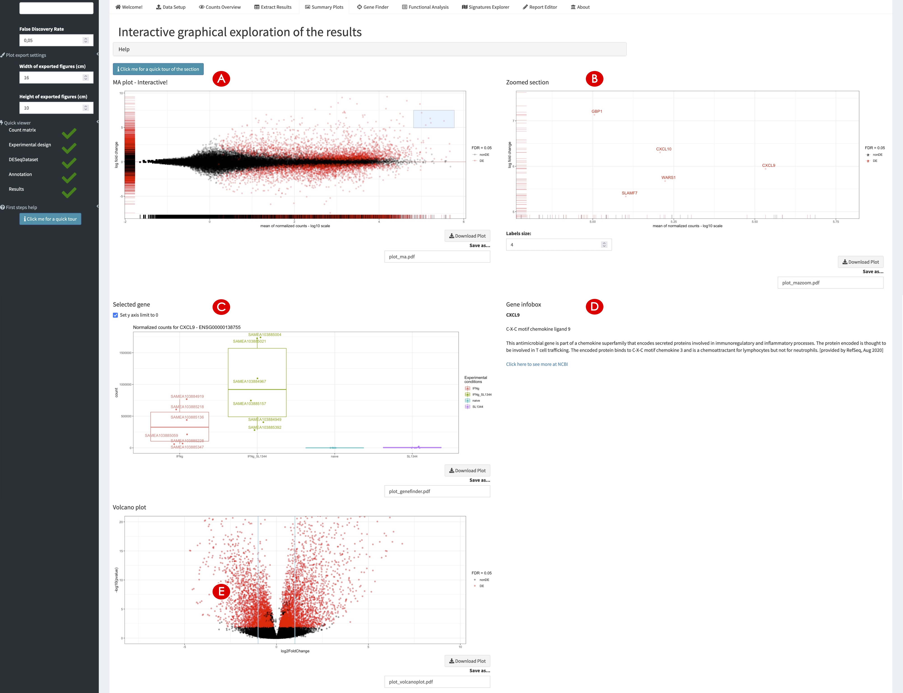
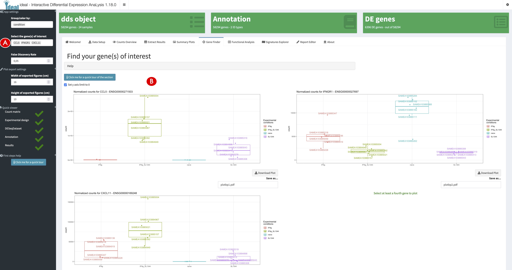
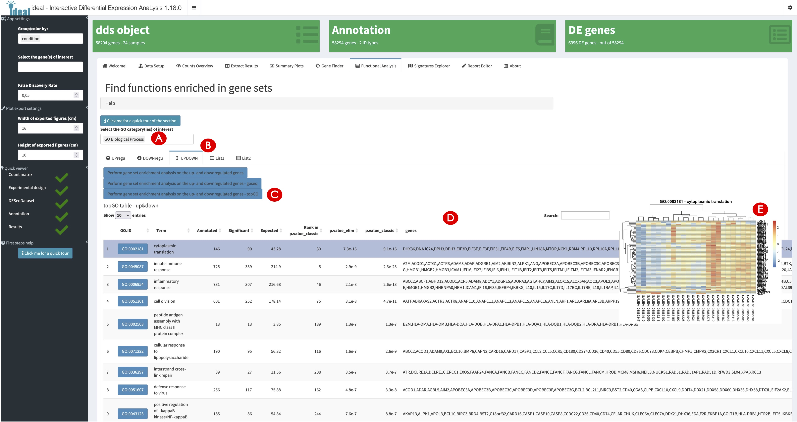
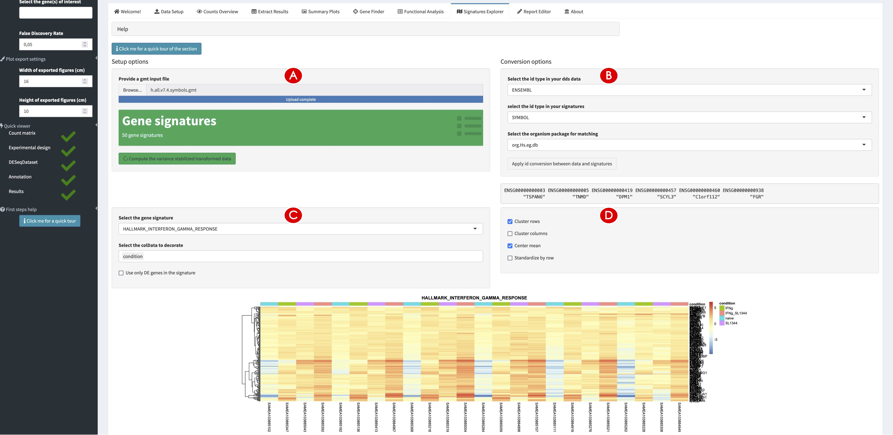
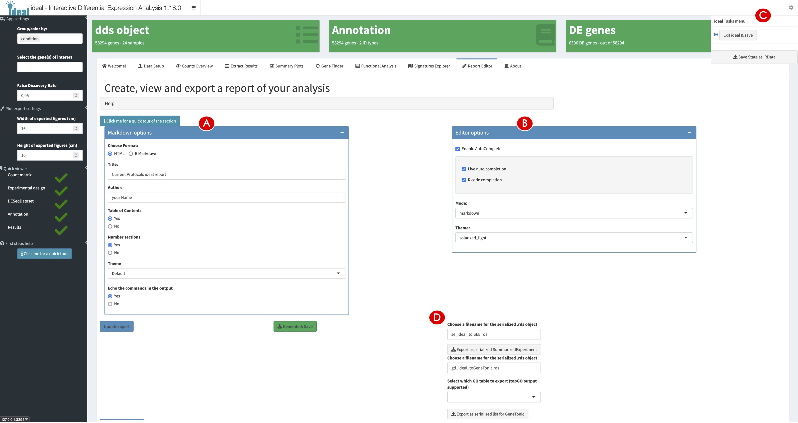

**Compiled date**: `r Sys.Date()`

**Last edited**: `r Sys.Date()`

```{r setup, include = FALSE, cache = FALSE, eval = TRUE, echo = FALSE}
library("knitr")
opts_chunk$set(
  fig.align = "center",
  fig.show = "asis",
  eval = TRUE,
  fig.width = 10,
  fig.height = 7,
  tidy = FALSE,
  message = FALSE,
  warning = FALSE,
  size = "small",
  comment = "##",
  echo = TRUE,
  results = "markup"
)
options(replace.assign = TRUE, width = 100)
```

```{r loadLibraries, results= "hide", eval=FALSE}
library("DESeq2")
library("topGO")
library("org.Hs.eg.db")
library("pcaExplorer")
library("ideal")
library("GeneTonic")
```

# Introduction

`ideal` [@Marini2020] is a Bioconductor package for the interactive analysis of RNA-seq data in the context of differential expression (DE) [@Love2015]. `ideal` guides the user through the different steps of a DE analysis, starting from the data upload, through the DESeq2 [@Love2014] workflow including normalization, filtering, exploration of differentially expressed genes, to functional analysis and gene signature exploration.

In this protocol we describe how to launch the `ideal` web application (also implemented in the Shiny framework [@Shiny2021]), running on the macrophage dataset [@Alasoo2018], which is also distributed as a Bioconductor package [@Huber2015].

# Necessary Resources

*Hardware*

* See detailed description in Support Protocol.

*Software*

* See detailed description in Support Protocol.

*Files*

* See detailed description in Support Protocol. Specifically, this Basic Protocol will make use of:
  * The count matrix file, containing the expression values for the macrophage dataset (countmatrix_macrophage.txt)
  * The file containing the information on the experimental covariates (metadata_macrophage.txt)
  * The annotation file (annotation_macrophage.txt), for handling the conversion between ENSEMBL identifiers and gene symbols
  * The gene signatures file (h.all.v7.4.symbols.gmt), as it is distributed via the MSigDB collections.
  
  The alternative entry points defined in this Basic Protocol also use some processed form of the text files listed above to generate the dds_obj and res_obj (described in detail in Step 1 below), ensuring that this procedure is fully reproducible (see Fig. 1A for a visual summary).


```{r fig1}
#| echo = FALSE,
#| fig.cap = "**Figure 1** - Workflow schematic for the presented protocols (A). The different data formats to provide to each of the protocols are represented as tabular or list-like elements, named by the scheme followed in the procedures illustrated in this work. Dashed arrows indicate that the provided information can be used to generate or annotate another object. Solid arrows (grey) denote that an object has been derived/computed from the other where the connector originated from. The small boxes close to each element explain in which protocol each object is used as primary (black) or secondary (grey) input. On the right side, the two main approaches delivered by our software (interactivity via web applications and reproducibility via reporting) are represented. A summary of the tasks each protocol accomplishes is detailed in (B) – linked together from the setup and installation, all the way down to the data interpretation."
knitr::include_graphics("figures_manuscript/msfigure_01.jpg")
```


# Protocol Steps with Steps Annotations

Before proceeding with the modeling of the RNA-seq data, the necessary packages and dependencies need to be installed and loaded. The Support Protocol describes how to install and load the packages.

**Starting up with the `ideal` package.**

1.	Load the `ideal` package and start the `ideal` web application.  
    The input data can be provided in different ways to the `ideal` application. Similar to `pcaExplorer`, it is possible to load the input files at runtime (reading from tab/comma/semicolon-separated text files, to be provided once the app is running) and launch the application with a simple command, leaving all other parameters unspecified:

    ```{r eval=FALSE}
    library("ideal")
    ideal()
    ```


    An alternative option is to provide the data as R objects (already loaded in the global environment) to the function `ideal()`, as in the following chunk:

    ```{r eval=FALSE}
    library("ideal")
    ideal(countmatrix = countmatrix, 
          expdesign = metadata, 
          annotation_obj = annotation, 
          gene_signatures = genesignatures)
    ```

    where `countmatrix`, `metadata`, and `annotation` have to be `data.frame` objects, and `genesignatures` has to be a list object (as shown in Fig. 1A in the Strategic Planning section, focusing on the black small boxes labeled BP2).

    A third option is to provide the data as a `DESeqDataSet` object (optionally with a corresponding `DESeqResults` object, if already computed – Fig. 1A, grey small boxes labeled BP2). These classes are the core containers used in the framework of the DESeq2 package [@Love2014].

    ```{r eval=FALSE}
    library("ideal")
    ideal(dds_obj = dds,
          res_obj = res_de)
    ```


    All of these options should open a browser window with the `ideal` application, which will display the Welcome panel by default.

2.	Explore the user interface of `ideal`.  
    When launching the dashboard, the landing page of `ideal` is the Welcome panel, providing the user information about the application and how to use it. We invite you to read up the material in the ‘Quick start for effective usage’ section, and to familiarize yourself with two of the help mechanisms provided in the app, namely the collapsible elements (containing text-based introductions) and the buttons to start guided tours of the interface (Fig. 13C). A sidebar is located on the left side of the user interface (Fig. 13A), and contains several input controls which affect different tab panels. By changing one or more of the input parameters, you can define what is computed by the app, and how these output elements are displayed. Moreover, the sidebar contains a ‘Quick viewer’, showing an overview of the underlying objects, required to perform all of the analyses offered by `ideal` - a green check icon appears close to each item, when the respective component is either provided or calculated. A compact summary of the main objects is also provided in the value boxes, in the top section of the body of the app (Fig. 13B).

```{r fig13}
#| echo = FALSE,
#| fig.cap = "**Figure 13** - Overview of the Data Setup panel in ideal. The sidebar (A) contains parameters affecting the behavior of many components, and the value boxes (B) summarize the current status of the analysis. Tours and collapsible elements (C) are available in each tab. The initial upload of the data is taken care in the Step 1 (D), while the statistical model is specified in Step 2 (E)."

```

3.	Setup the data for the analysis in `ideal`.  
    Navigate to the Data Setup panel. Inspect or upload interactively the required count matrix, and the experimental design data in the ‘Step 1’ box, marked by the red color (Fig. 13D). If uploading from text files, click on the respective buttons and select the files where this information is stored – make sure the encoding format is respecting the expected requirements for working in the `ideal` application.

4.	Specify the experimental design for the analysis.  
    In the ‘Step 2’ box, marked in yellow, you can select the experimental design (Fig. 13E); specify ‘line’ and ‘condition’ for the `macrophage` dataset, and click on the green action button (‘Generate the dds object’). This specification will enable you to estimate the effect size of the ‘condition’ variable, while controlling for the cell line of origin, leveraging the flexible generalized linear model framework [@Anders2013]. If you desire to understand more about more complex model specifications, which might be possible depending on the structure of your data, we recommend to use tools such as `ExploreModelMatrix` [@Soneson2020] for this purpose. Upon generation of the `DESeqDataSet` object, the respective value box on top turns green, and also the sidebar field for it will get a green check mark.

5.	Add a gene annotation and exclude samples from the analysis if required (optional).  
    The two light blue boxes that have appeared provide the optional steps for adding the appropriate annotation and discarding unwanted samples (e.g., if your initial data exploration in Basic Protocol 1 revealed the presence of an outlier, Fig. 14A, 14B). If you did not pass an annotation at application start, select ‘Human’ as species for the macrophage dataset, ‘ENSEMBL‘ as the id type [@Howe2021], and confirm the selection with the blue button ‘Retrieve the gene symbol annotation for the uploaded data’. Once this is terminated, the value box for the annotation object is displayed in green (Fig. 13B).

```{r fig14}
#| echo = FALSE,
#| fig.cap = "**Figure 14** - Further content of the Data Setup panel in ideal. An annotation table can be generated (A), and samples can be excluded if deemed as outliers (B) – proper exploration of the data is recommended, as detailed in Basic Protocol 1. After running the DESeq2 main wrapper (C), users can explore diagnostic plots, contained in a collapsible element (D)."

```

6.	Run the differential expression analysis.  
    Finally, run the main function of the `DESeq2` framework in Step 3 (green box) by clicking on the button ‘Run DESeq’ (Fig. 14C). If multiple cores are available, you can use the slider input to select the number of CPUs to use for speeding up the computation. Once this is completed, you can inspect the mean-dispersion plot as a diagnostic check by expanding the collapsible element below (Fig. 14D).

**Exploring the count matrix and the differential expression result table.**

7.	Inspect (and filter) the expression count matrix.  
    Navigate to the Counts Overview panel, which provides an interactive table, which can display raw, normalized, and log-normalized values for all the genes and samples in the data (Fig. 15A). A summary for the expressed features is reported below - you can set a threshold for either criterion to filter out the lowly expressed genes (Fig. 15B). This can also reduce the computation time without impacting the quality of the results. Filter the macrophage data with a threshold of zero on the row sums of the counts by clicking on the ‘Filter the DDS object’ button (Fig. 15C). Generate and inspect the sample-to-sample scatterplot matrix below (Fig. 15D) which shows the similarity across all individual samples while regarding the information on the single features - this can be quite useful for detecting unexpected patterns for subsets of genes [@Rutter2019].

```{r fig15}
#| echo = FALSE,
#| fig.cap = "**Figure 15** - Content of the Counts Overview panel in ideal. The expression table is shown interactively (A), with the possibility to define thresholds for expression (B) and accordingly filter the data before testing (C). A scatterplot matrix can be displayed in the bottom section (D), with functionality shared with pcaExplorer."

```

8.	Compute the differential expression results.  
    Navigate to the Extract Results panel to compute and explore the results for the differential expression analysis (Fig. 16). Set the alpha level for significance to control the False Discovery Rate in the sidebar; for the macrophage data we can leave the value set to the default (0.05). Then, proceed to define the contrast of interest - this Basic Protocol focuses on the comparison between the Interferon-gamma treated cell line (IFNg) versus the untreated one (naive). Therefore, first select ‘condition’ as the experimental factor to build the contrast upon (Fig. 16A). Then select ‘IFNg’ as the numerator level, and ‘naive' as the denominator level for the fold change (Fig. 16B). Further options are provided to refine the results, whereas independent filtering [@Bourgon2010] or the Independent Hypothesis Weighting (IHW) can be applied [@Ignatiadis2016]. After clicking on ‘Extract the results’ (Fig. 16C) you can see that in the macrophage dataset more than 6000 genes have been detected as differentially expressed for the IFNg treatment vs naive contrast (Fig. 16D).  
    Additionally, the value box for the DE genes is updated and displayed in green. IRF1, IL18BP, and GBP2 are listed in the table below as the top regulated genes, sorted by their adjusted p-values. The interactive table directly links the gene symbols and the ENSEMBL identifiers to external databases for that feature, either Ensembl (https://www.ensembl.org/) or the NCBI Gene Database (https://www.ncbi.nlm.nih.gov/gene) (Fig. 16D). 

```{r fig16}
#| echo = FALSE,
#| fig.cap = "**Figure 16** - Overview of the Extract Results panel in ideal. The contrast can be specified by combining the covariate of interest (A) and the levels to compare (B). Results can be extracted once the respective button is visible (C), and are displayed both as summary and in full tabular format (D). Diagnostic plots on the DE results are included in the bottom section of the page."

```

9.	Inspect the diagnostic plots for the extracted DE results.  
    The top left and right plots show raw p-value histograms, useful for checking the assumption of uniform distribution under the null hypothesis, also stratified by mean expression value (relevant if one is using the Independent Hypothesis Weighting for adjusting the p-value). The bottom left Schweder-Spjøtvoll plot [@Schweder1982], shows the ranked p-values: this is a graphical method to illustrate the Benjamini-Hochberg multiple testing adjustment procedure [@Benjamini1995], with the intersection point defining the subset of genes for which the False Discovery Rate (FDR) is controlled at the chosen level. The bottom right plot is a histogram of the log2 fold change values, to show its distribution and identify anomalies such as highly skewed tails.
    
**Exploring overviews of the results and single genes of interest.**

10.	Generate overview visual representations of the DE results.  
    Navigate to the Summary Plots panel to generate a set of visual summaries of the results (Fig. 17). This includes an MA plot, which can be regarded as an application of a Bland-Altman plot for the representation of genomic data – M being the log ratio, and A the mean average. Select in the MA plot (log2FoldChange vs mean expression values) some of the upregulated genes by brushing on the area that includes them (Fig. 17A). A zoomed-in version of the MA plot focused on the selected area will appear on the right side, providing labeling by gene symbols if these are defined in the annotation object (Fig. 17B).

```{r fig17}
#| echo = FALSE,
#| fig.cap = "**Figure 17** - Overview of the Summary Plots panel in ideal. The MA plot (A) displays the expression changes against the mean expression values, marking single genes according to the significance level. Labels are added in the zoomed panel (B). Boxplots for individual genes are also provided (C), with extra information from the Entrez database (D). A volcano plot is also presented (E), depicting the direct relationship between expression changes and significance of the genes."

```

11.	Inspect single genes upon interacting with the MA plot panel.  
    Click on a gene in the zoomed selection plot. If the ‘Group/color by’ widget in the sidebar has a selection active (defaulting to the experimental factor of interest specified in the contrast), this action will display a boxplot for the expression values in all conditions (Fig. 17C), and additional info retrieved from the Entrez database (Fig. 17D). In the middle section, you can view the results as a volcano plot (Fig. 17E), where the significance is directly plotted against the effect size (and direction). In addition, the subset of genes included in the rectangular selection is also displayed as heatmaps (both static and dynamic). Tabular information on the selected genes can be further exported from the collapsible element at the bottom of the tab panel.

12.	Inspect single genes upon manual selection.  
    Navigate to the Gene Finder panel and explore a subset of genes of interest (Fig. 18). In this protocol we will define the genes CCL5, IFNGR1, and CXCL11 as genes of interest in the sidebar (Fig. 18A). The tab panel displays up to four gene expression boxplots for the selected genes (Fig. 18B), and also displays an MA plot where the shortlisted genes are annotated. The table containing all relevant values for the genes included in the selector widget can be explored in the collapsible element, and downloaded as text file. To avoid manually selecting many genes (from the selectize widget in the sidebar), you can also upload a list as a plain text file, specifying one feature per row; these will be annotated in an alternative version of the MA plot, and the corresponding table is provided below it.

```{r fig18}
#| echo = FALSE,
#| fig.cap = "**Figure 18** - Overview of the Gene Finder panel in ideal. The selection of features is done from the sidebar (A), and the shortlisted genes are displayed in the main panel content (B)."

```

**Performing functional enrichment analyses on the data and exploring gene signatures.**

13.	Calculate overrepresented biological processes in the set of differentially expressed genes.  
    Navigate to the Functional Analysis panel to perform a gene set enrichment analysis on the differentially expressed genes, with the aim of gaining insight on the affected biological pathways (Fig. 19). In the ‘Select the GO category(ies) of interest’, make sure that ‘GO Biological Process’ is included (Fig. 19A); alternative ontologies comprise ‘GO Molecular Function’ and ‘GO Cellular Component’. The functional enrichment analyses can be performed on different sets of genes: only the upregulated ones (tab panel ‘UPregu’); only the downregulated ones (tab panel ‘DOWNregu’); including both up- and downregulated genes (tab panel ‘UPDOWN’); any custom list of genes (in the two panels ‘List1’ and ‘List2’). Navigate to the ‘UPDOWN’ tab panel to perform the gene set enrichment analysis on the up- and downregulated features (Fig. 19B).
    Three methods of overrepresentation analysis (ORA) are implemented in `ideal`: 1. The standard ORA based on the `limma` package [@Ritchie2015], 2. the `goseq` ORA, which accounts for the specific length bias intrinsic in RNA-seq assays (longer genes have higher chances of being called DE) [@Young2010], and 3. the `topGO` ORA, which decorrelates the Gene Ontology graph structure and is particularly valuable for pruning terms that are topologically less meaningful than their specific nodes [@Alexa2006]. Perform the analysis with `topGO`, by clicking on the button called ‘Perform gene set enrichment analysis in the up- and downregulated genes – topGO’ (Fig. 19C). 

```{r fig19}
#| echo = FALSE,
#| fig.cap = "**Figure 19** - Overview of the Functional Analysis panel in ideal. The categories can be selected from the dedicated input widget (A), and different subsets of genes, based on the direction of the change in expression, can be used to compute the functional analysis (B). The enrichment algorithms can be started via the buttons below (C). Once the results are available, they are displayed in a table (D); upon interaction with single rows in the results from topGO, heatmaps for the specific signature are displayed, summarizing the expression values for the associated gene set members (E)."

```

14.	Explore the results of the enrichment analysis.  
    As a result of the previous step, an interactive downloadable table appears (Fig. 19D), listing the relevant GO terms and the enrichment-relevant features, including e.g., the list of the differentially expressed genes annotated to each of the reported GO terms. Click on the blue button of the GO term GO:0002181 ('cytoplasmic translation’) to get further information from the AmiGO database (https://amigo.geneontology.org/). If clicking anywhere in the row of the enriched GO term, a heatmap is displayed, showing the normalized and transformed expression values for the subset of DE genes assigned to each term, making it easy to inspect the overall regulation of a selected signature (Fig. 19E). In the bottom section of this page, the subsets of genes that could have been used for computing enrichment results (see Step 13) can be provided as input for a simple overlap analysis, by means of a Venn diagram and of an upset plot (particularly useful when including large numbers of sets).

15.	Explore the expression profiles of gene signatures.  
    Navigate to the Signature Explorer panel (Fig. 20) and upload the `h.all.v7.4.symbols.gmt` file (originally retrieved from the MSigDB database, we refer to the Support Protocol for further detail on obtaining the file). The green info box in the middle of the panel will report the number of signatures contained - in this case, the 50 hallmark signatures are present in the uploaded GMT file (Fig. 20A). Compute the variance stabilized transformed data by clicking of the corresponding button. To match the identifier types of your data with the signatures (Fig. 20B), select ‘ENSEMBL’ as the ID type in your `dds` data, ‘SYMBOL’ as the ID type of your signatures, and `org.Hs.eg.db` as the organism package for performing the match, by means of the ’Apply id conversion between data and signatures’ button. In the lower section of the panel, select the gene signature of interest, e.g., HALLMARK_INTERFERON_GAMMA_RESPONSE and condition in the selection widget called ‘Select the colData to decorate’ (Fig. 20C). Optionally, use the check box below to include only the DE genes of the signature, filtering out the ones detected as non-significant. A heatmap appears at the bottom of the panel, and can be further customized with the available checkboxes (Fig. 20D); mean centering (or even row standardization) is useful to simplify comparison across samples, while clustering options enable the detection of interesting groups of features.

```{r fig20}
#| echo = FALSE,
#| fig.cap = "**Figure 20** - Overview of the Signature Explorer panel in ideal. After uploading the signatures (A) and performing matching to the data at hand (B), users can specify which experimental covariates to use for the decoration of the signature heatmaps (C), with extra option to customize their appearance (D)."

```

**Wrapping up the analysis with `ideal`.**

16.	Generate, preview, and export an analysis report.  
    Navigate to the Report Editor panel to generate and download a report of the analysis containing the current state of the parameters and generated images (Fig. 21). This functionality is shared with the `pcaExplorer` package, and is based on a comprehensive template report provided with the `ideal` package. After selecting ‘HTML’ as output format (and some general Markdown options), you can preview the report in the lower section of the panel (Fig. 21A, 21B). Experienced users can edit the RMarkdown source of the report in the ‘Edit report’ tab panel. Once the report is finalized, click on ‘Generate & Save’ to compile the document and store it on your system.

```{r fig21}
#| echo = FALSE,
#| fig.cap = "**Figure 21** - Overview of the Report Editor panel in ideal. Options for Markdown (A) and the report editor (B) are included, and can be changed before rendering the document. Functionality for exporting the entire state of the app (C), or as a SummarizedExperiment object (D) is also provided, simplifying the interoperability with other existing software."

```

17.	Export the analyses components for further downstream exploration.  
    Open the Tasks menu from the small cogs icon in the top right of the header (Fig. 21C). From there, it is possible to export the state of the app’s reactive elements into a binary .RData workspace, or also store their values directly into an environment; this environment can be retrieved in the R session by calling `ideal_env`, after the app is closed.
Clicking on the ‘Export as serialized SummarizedExperiment’ button (in the Report Editor panel, Fig. 21D) will create a serialized rds object, where the essential content computed in the dashboard is coerced into a `SummarizedExperiment` object for further use, e.g., with `iSEE` [@Rue-Albrecht2018] for bespoke visualizations. If enrichment results have been derived with `topGO`, it is also possible to export the whole set of current data and results as a `GeneTonicList`, making this object perfectly suitable to explore as described in Basic Protocol 3.


<hr>

# Session information {-}

```{r}
BiocManager::version()
sessionInfo()
```
`
<hr>

# References

