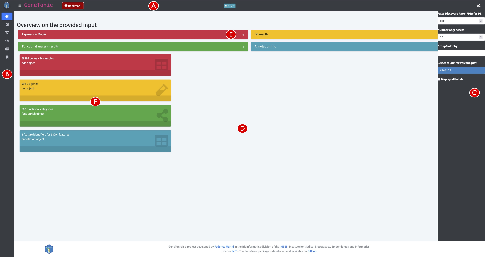
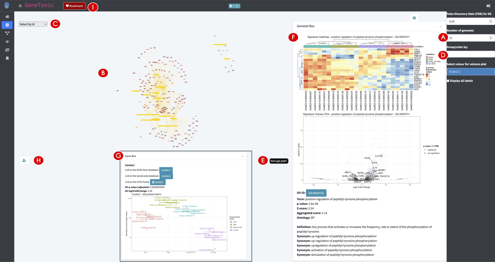
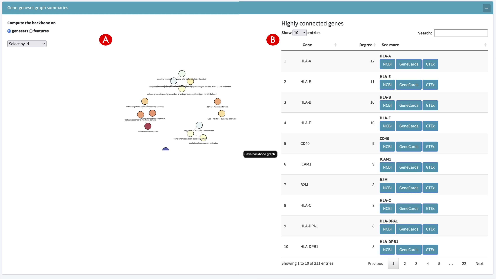
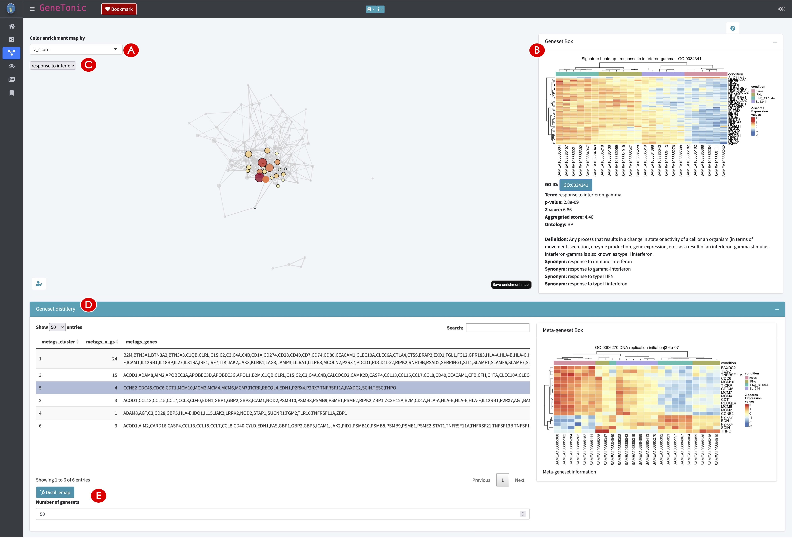
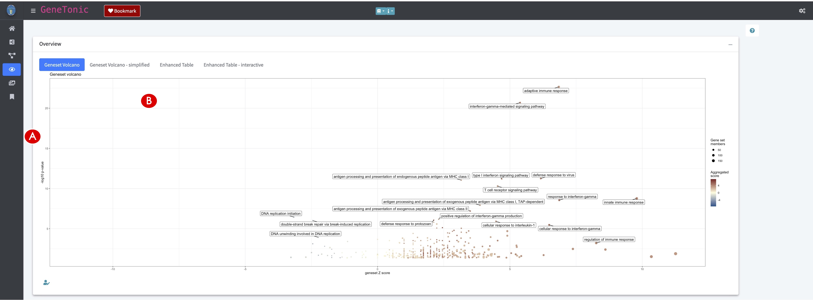
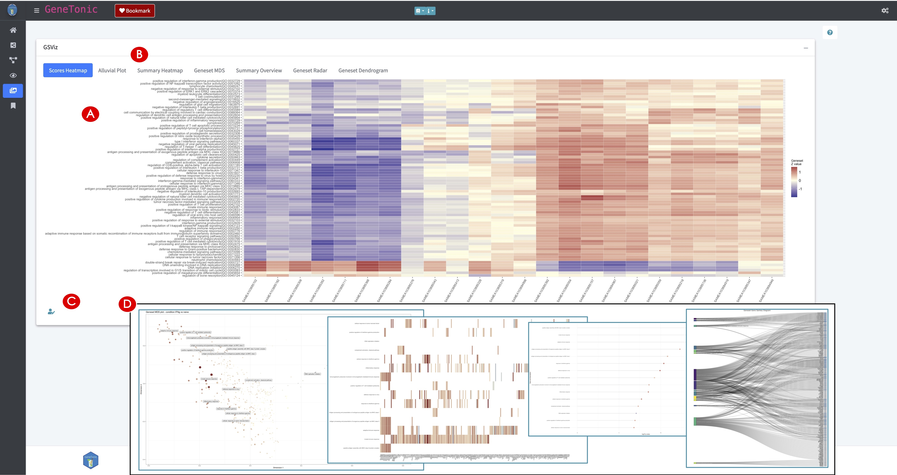
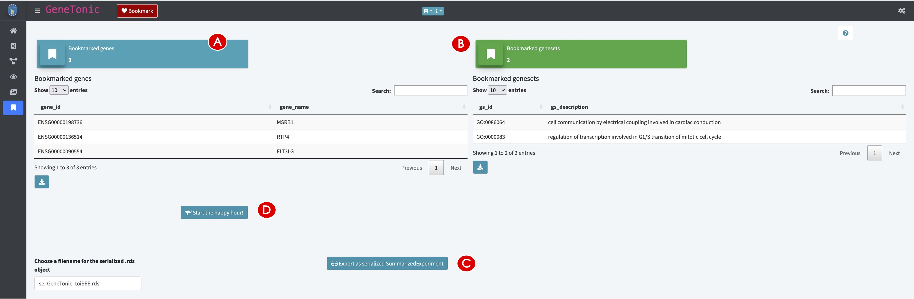

**Compiled date**: `r Sys.Date()`

**Last edited**: `r Sys.Date()`

```{r setup, include = FALSE, cache = FALSE, eval = TRUE, echo = FALSE}
library(knitr)
opts_chunk$set(
  fig.align = "center",
  fig.show = "asis",
  eval = TRUE,
  fig.width = 10,
  fig.height = 7,
  tidy = FALSE,
  message = FALSE,
  warning = FALSE,
  size = "small",
  comment = "##",
  echo = TRUE,
  results = "markup"
)
options(replace.assign = TRUE, width = 100)
```

```{r loadLibraries, results= "hide", eval=FALSE}
library("DESeq2")
library("topGO")
library("org.Hs.eg.db")
library("pcaExplorer")
library("ideal")
library("GeneTonic")
```

# Introduction

`GeneTonic` [@Marini2021] is a Bioconductor package for streamlining the interpretation of results from differential expression analysis together with functional enrichment analysis, integrating these components with the original expression data and annotation tables for easy identifier conversion [@Love2015]. Blending together the existing pieces of transcriptome datasets in a Shiny web application [@Shiny2021], users can interactively generate insightful observations and hypotheses, while still profiting from code reproducibility, guaranteed by the creation of an HTML report and code snippets meta-generated along the outputs.

In this protocol, we will describe its usage to analyze in depth the macrophage dataset [@Alasoo2018], made available as a Bioconductor package itself [@Huber2015]. Samples from the macrophage dataset are available from 6 different donors, in 4 different conditions - naive, treated with Interferon-gamma, upon SL1344 (*Salmonella enterica*) infection, or with a combination of Interferon-gamma and SL1344. We will focus our attention on the comparison between Interferon-gamma treated samples versus naive samples - these results have been previously generated through the other Basic Protocols. 

# Necessary Resources

*Hardware*

* See detailed description in Support Protocol.

*Software*

* See detailed description in Support Protocol.

*Files*

* See detailed description in Support Protocol. Specifically, this Basic Protocol will make use of the dataset delivered in the `macrophage` software package, from which it is possible to derive all necessary components, once the required dependencies are installed (as described in the Support Protocol).  
  Alternatively, we provide a precomputed `GeneTonicList` object in the `manuscript_CPBioinfo_2021` repository (see Step 7 below) – the initial steps in this protocol specify the procedure to generate the components of this structured object (`dds`, `res_de`, `res_enrich`, and `annotation_obj`) (see Fig. 1A for a visual overview). Alternatively, it is also possible to generate the `GeneTonicList` object with  `ideal`, as described in the final steps of Basic Protocol 2.

```{r fig1}
#| echo = FALSE,
#| fig.cap = "**Figure 1** - Workflow schematic for the presented protocols (A). The different data formats to provide to each of the protocols are represented as tabular or list-like elements, named by the scheme followed in the procedures illustrated in this work. Dashed arrows indicate that the provided information can be used to generate or annotate another object. Solid arrows (grey) denote that an object has been derived/computed from the other where the connector originated from. The small boxes close to each element explain in which protocol each object is used as primary (black) or secondary (grey) input. On the right side, the two main approaches delivered by our software (interactivity via web applications and reproducibility via reporting) are represented. A summary of the tasks each protocol accomplishes is detailed in (B) – linked together from the setup and installation, all the way down to the data interpretation."
knitr::include_graphics("figures_manuscript/msfigure_01.jpg")
```


# Protocol Steps with Steps Annotations

Before using `GeneTonic` for exploring the full set of results from the differential expression analysis workflow, the necessary packages and dependencies need to be installed and loaded. The Support Protocol describes how to install and load the packages.

The input data to be provided to `GeneTonic` can be computed via different workflows, but for simplicity it is easiest when using the framework of `DESeq2` - we refer users to the package vignette for alternative methods upstream like `limma` or `edgeR.` If starting from this Basic Protocol, please use the following commands to generate the entire set of required files.

**Generating the required input for running `GeneTonic`.**

1.	Generate the `DESeqDataSet` object.  
    We load the `macrophage` dataset, specify the design of interest (testing on the condition, while accounting for the cell line of origin), change the identifiers to ENSEMBL (instead of the provided GENCODE ids, that would not match with the annotation packages). Optionally, you can apply some filtering on a minimal detection threshold - in this case, we require to have at least 10 counts, in at least 6 samples (6 being the size of the smallest experimental group).

    ```{r eval=FALSE}
    # Loading the data
    library("macrophage")
    library("DESeq2")
    library("GeneTonic")
    data("gse", package = "macrophage")
    dds_macrophage <- DESeqDataSet(gse, design = ~line + condition)
    # Changing the ids, removing the GENCODE-specific suffix
    rownames(dds_macrophage) <- substr(rownames(dds_macrophage), 1, 15)
    
    # Filtering low expressed features
    keep <- rowSums(counts(dds_macrophage) >= 10) >= 6 
    dds_macrophage <- dds_macrophage[keep, ]
    dds_macrophage
    
    ## class: DESeqDataSet 
    ## dim: 17806 24 
    ## metadata(7): tximetaInfo quantInfo ... txdbInfo version
    ## assays(3): counts abundance avgTxLength
    ## rownames(17806): ENSG00000000003 ENSG00000000419 ... ENSG00000285982 ENSG00000285994
    ## rowData names(2): gene_id SYMBOL
    ## colnames(24): SAMEA103885102 SAMEA103885347 ... SAMEA103885308 SAMEA103884949
    ## colData names(15): names sample_id ... condition line
    ```
    

2.	Generate the differential expression result object.  
    Run the `DESeq2` pipeline on the provided dataset, specifying the contrast of interest (Interferon-gamma treatment vs naive cells), and an absolute log2 fold change threshold of at least 1 to test against. This is different from the commonly performed post-hoc filtering of subsetting for genes whose absolute expression change is reported as at least 1 - this approach does not guarantee the control of the False Discovery Rate. We add the gene symbol identifier to ease the readability of the table.
    
    ```{r eval=FALSE}
    # running DESeq2 and extracting the results
    dds_macrophage <- DESeq(dds_macrophage)
    res_macrophage_IFNg_vs_naive <- results(dds_macrophage,
                                            contrast = c("condition", "IFNg", "naive"),
                                            lfcThreshold = 1, 
                                            alpha = 0.05)
    res_macrophage_IFNg_vs_naive$SYMBOL <- rowData(dds_macrophage)$SYMBOL
    # Alternatively, the result is provided as precomputed object in the `GeneTonic` package
    data("res_de_macrophage", package = "GeneTonic")
    ```


3.	Run the functional enrichment analysis.  
    This step is here performed via the `pcaExplorer` wrapper `topGOtable`(), using the `topGO` method (with the ‘elim’ algorithm). A sensible background is selected, choosing the set of all detected genes in the assay. We identify the overrepresented Biological Processes from the Gene Ontology database, and convert the resulting table in the format expected by `GeneTonic`. Alternatively, a variety of methods and applications can be used to compute a similar enrichment table; we refer the reader to the `GeneTonic` vignette, detailing the supported software.
    
    ```{r eval=FALSE}
    # Sort the results by FDR
    library("AnnotationDbi")
    
    # Define the DE subset and the background set
    de_symbols_IFNg_vs_naive <- deseqresult2df(res_macrophage_IFNg_vs_naive, FDR = 0.05)$SYMBOL
    background_symbols <- rowData(dds_macrophage)$SYMBOL[rowSums(counts(dds_macrophage)) > 0]
    # Compute the enrichment results
    library("topGO")
    topgoDE_macrophage_IFNg_vs_naive <-
      pcaExplorer::topGOtable(DEgenes = de_symbols_IFNg_vs_naive,
                              BGgenes = background_symbols,
                              ontology = "BP",
                              mapping = "org.Hs.eg.db",
                              geneID = "symbol",
                              topTablerows = 500)
    # Convert for usage in `GeneTonic`
    res_enrich_macrophage <- shake_topGOtableResult(topgoDE_macrophage_IFNg_vs_naive)
    # Alternatively, the enrichment result is also available as a precomputed object
    data("res_enrich_macrophage", package = "GeneTonic")
    ```

4.	Construct the annotation object.  
    Construct a table with at least two mandatory columns, `gene_id` and `gene_name`, to handle the conversion between an unambiguous identifier (ENSEMBL, GENCODE, Entrez) into a human-readable format (typically, HGNC gene symbols).
    
    ```{r eval=FALSE}
    library("org.Hs.eg.db")
    anno_df <- data.frame(
      gene_id = rownames(dds_macrophage),  
      gene_name = mapIds(org.Hs.eg.db, 
                         keys = rownames(dds_macrophage), 
                         column = "SYMBOL", 
                         keytype = "ENSEMBL"),
      stringsAsFactors = FALSE,
      row.names = rownames(dds_macrophage)
    )
    ```


    Alternatively, if following Basic Protocol 2 you obtained these objects via `ideal`, you can use this code chunk – you should replace the right-hand side of the assignment with the name of the objects in the environment in use.

    ```{r eval=FALSE}
    dds_object <- dds_from_ideal
    res_de_object <- res_from_ideal
    res_enrich_object <- shake_topGOtableResult(res_enrich_from_ideal)
    annotation_object <- annotation_from_ideal
    ```


5.	Compute aggregated scores on the enrichment results (optional).  
    The function `get_aggrscores()` can be called on the ensemble of objects we just generated, to compute two additional columns for the input `res_enrich` object. The `z_score` and `aggr_score` values try to summarize geneset-wise the effect (`log2FoldChange`) of the differentially expressed genes that are listed as its members, either by simply counting them or applying a function (in the example below, the mean is used, but other functions could be applied such as the median). These are estimates of the “direction” of expression change reflected on higher level features such as pathways or genesets. We refer to the original publication of `GeneTonic` for more details on how these scores are computed [@Marini2021].
    
    ```{r eval=FALSE}
    res_enrich_macrophage <- get_aggrscores(
      res_enrich = res_enrich_macrophage,
      res_de = res_macrophage_IFNg_vs_naive,
      annotation_obj = anno_df,
      aggrfun = mean
    )
    ```

**Preparing to run the `GeneTonic` application.**

6.	Assemble the `GeneTonicList` object.  
    Once the four components (Fig. 1A, black small boxes labeled BP3) have been computed and are loaded in the R environment, load the `GeneTonic` package and create an instance of a `GeneTonicList` object. A summary of the elements in the list will be printed out to the console upon creation.

    ```{r eval=FALSE}
    gtl_macrophage <- GeneTonic_list(
      dds = dds_macrophage,
      res_de = res_macrophage_IFNg_vs_naive,
      res_enrich = res_enrich_macrophage,
      annotation_obj = anno_df
    )
    ```


7.	Start the `GeneTonic` application.  
    Once the `GeneTonicList` is generated, `GeneTonic` can simply be called with one line of code.

    ```{r eval=FALSE}
    GeneTonic(gtl = gtl_macrophage)
    ```

    Interestingly, this can be a common entry point for wet-lab scientists, who might benefit of the expertise of a bioinformatician to perform the steps upstream, and receive a single serialized file to be loaded into the R environment. If encoded as a `GeneTonicList` (Fig. 1A, grey small box labeled BP3), this object would contain all the information regarding the experiment and setting of interest, as exemplified in the chunk below - you can also load a precomputed object, provided in the `manuscript_CPBioinfo_2021` repository.

    ```{r eval=FALSE}
    gtl_provided <- readRDS("path_to/gtl_object.RDS")
    GeneTonic(gtl = gtl_provided)
    
    # using the version provided in the repository:
    gtl_reimported <- readRDS("gtl_macrophage_exported.RDS")
    describe_gtl(gtl_reimported)
    GeneTonic(gtl = gtl_reimported)
    ```

**First steps using `GeneTonic`.**

8.	Explore the user interface of `GeneTonic`.  
    `GeneTonic`’s layout (Fig. 22) is built on the Bootstrap 4 components, provided via the `bs4Dash` package. This includes:
    - A header bar, where dropdown menus link to further documentation, and where the ‘Bookmark’ button is located, which is useful for recording features of interest during an interactive session (Fig. 22A)
    - A sidebar on the left, as the main way to access the different functionalities provided in the app (Fig. 22B)
    - A control bar on the right, where to find most widgets to customize the appearance of the output (plots, tables, graphs, Fig. 22C). This can be opened and closed by clicking on the cogs icon in the top right corner.
    - The main body of the application, where different tabs are activated by clicking on the respective icons or text in the sidebar (Fig. 22D). In each of the panels, a context-specific interactive tour can be started by clicking on its respective button in the top right corner. This highlights in series the elements of the app, accompanying this with textual help that invites users to perform basic operations; this learning-by-doing approach is powered by the `rintrojs` library [@Ganz2016a].

```{r fig22}
#| echo = FALSE,
#| fig.cap = "**Figure 22** - Overview of the Welcome panel in GeneTonic. The header bar (A) contains links to further documentation, while the sidebar (B) allows the navigation between panels. The control bar (C) contains widgets to customize the aspect and content of the main body of the application (D). Collapsible elements can be expanded by clicking on the plus sign (E), and value boxes (F) provide an overview on the input data. "

```

9.	Explore an overview on the provided input.  
    After starting the application, you will be in the Welcome panel, marked by the home icon in the sidebar. Open the collapsible elements, ‘Expression Matrix’, ‘DE results’, ‘Functional analysis results’, and ‘Annotation info’, by clicking on the plus sign (Fig. 22E). Each of them presents a tabular view of the elements of the provided `GeneTonicList`. The value boxes below give a rapid overview on the dimensions of these objects (Fig. 22F). If desired, you can take the introductory tour for this panel, as a way to gain additional familiarity with the user interface.
    
**Constructing an interactive gene-geneset network for functionally enriched biological processes.**

10.	Create and explore the Gene-Geneset network.  
    Navigate to the Gene-Geneset panel (Fig. 23). Use the left sidebar for this purpose - upon selection, a spinning loader will be displayed while the object is computed and rendered in the main body of the app. By default, 15 genesets are displayed; this behavior can be changed by setting a different value in the control bar (right side of the app, Fig. 23A). The bipartite graph underlying the Gene-Geneset network contains two sets of entities, and their connections reflect the membership of differentially expressed genes to the subset of genesets selected (Fig. 23B). This network can be explored in an interactive manner, avoiding the static “hairball” effect that would arise if a large number of genesets is selected, or if many nodes are present (irrespective of their type). It is possible to zoom in the network by scrolling, pan by clicking and holding the left mouse button, select by hovering or clicking on a node of interest. Additionally, the ‘Select by id’ dropdown selector allows you to search for specific nodes (here, both genes and genesets), while presenting them as an alphanumerically sorted list (Fig. 23C). Every time a node is hovered with the mouse, some information is directly displayed as a tooltip in the main network frame.

```{r fig23}
#| echo = FALSE,
#| fig.cap = "**Figure 23** - Overview of the Gene-Geneset panel in GeneTonic. Upon specifying the number of included genesets (A), the gene-geneset graph is shown in the main body of the panel (B). The selection of individual nodes can be done by hovering or by using a dropdown menu (C). The aspect of in-depth info boxes can be adjusted by defining covariates of interest (D), and the graph can be saved as static image (E). The content of the Geneset Box (F) and of the Gene Box (G, shown as inset) serves as means to quickly explore specific nodes. Code to reproduce the current content is displayed by clicking on the dedicated button (H), and nodes of interest can be bookmarked for later (re-)inspection (I)."

```

11.	Edit the Gene-Geneset network.  
    Change the number of displayed genesets to 25, by entering this value in the control bar field ‘Number of genesets’ (Fig. 23A). The graph object is automatically recomputed and displayed. In the ‘Group/color by’ widget (Fig. 23D), select ‘condition’, since this will be used as the main grouping of interest, as it was defined in the DE contrast - this will be relevant especially when performing drilldown operations in the following steps. You can move around the nodes by dragging and dropping them, and eventually save a static snapshot of this as a png image (by clicking on the dedicated ‘Save ggs graph’ button, Fig. 23E).

12.	Explore in depth the nodes of the network.  
    Genesets are encoded as rectangular yellow boxes. Click on any geneset in the network (Fig. 23B); upon doing this, the Geneset Box on the right side will display a signature heatmap for the pathway of interest, and a volcano plot where the individual genes are annotated (Fig. 23F). Extra information, as retrieved from the `GO.db` annotation package, is displayed below, with a link to reach the corresponding entry in the AmiGO database. On the other hand, genes are marked as oval-shaped nodes, with a color scale mirroring the expression change in the differential expression comparison (Fig. 23B). When clicking on a gene, the normalized expression values are displayed, grouped by the experimental covariates selected (see inset in Fig. 23G). According to the number of data points in each group, a sensible visual encoding is chosen (points, boxplot, violin, or a sina plot) - individual sample labels are also displayed if not cluttering the graphical output. If users intend to reproduce the output of the network in a later session, detached from the execution as a web application, the button with a user-edit icon opens up a modal dialog window, where the code to recreate the content is automatically generated and provided (Fig. 23H); this also serves as a bridge to learn how to assemble all the individual analysis components into a full scripted report.

13.	Bookmark a subset of genes and genesets.  
    While exploring the network, if a node is selected, it is possible to bookmark it by either clicking on the ‘Bookmark’ button in the header (Fig. 23I), or by using the left Ctrl key as a shortcut. Repeat this operation until a number of nodes has been selected, making sure to select entities from both categories. The bookmarks are stored for the duration of the session, and can be previewed in the Bookmarks panel (described in the following steps).

14.	Calculate and explore the backbone of the Gene-Geneset network.  
    Below the main network, you can find the functionality to explore a backbone of this bipartite graph. The backbone, as defined in the work of [@Domagalski2021], can be seen as an unweighted subgraph containing only the most significant edges - *de facto* being a summary of the full network. You can extract the backbone for both entity types; click first on the ‘Gene-geneset graph summaries’ collapsible element, and see the backbone network being seamlessly generated (Fig. 24A). Click on the ‘features’ option on the respective button to construct the dual graph, focused on the genes. As a complement to this, the table on the right side ranks the genes according to their degree of connectivity (Fig. 24B); this can be important to identify hub-like genes that might be involved in a multitude of biological processes. Similar to the Gene info box, links to external databases are automatically provided, to simplify the further steps of exploration when trying to generate new hypotheses by cross-referencing the own project with published literature.

```{r fig24}
#| echo = FALSE,
#| fig.cap = "**Figure 24** - Further content of the Gene-Geneset panel in GeneTonic. In addition to the main content, the backbone of the bipartite graph can be rendered (A), and some connectivity information for the main network are presented in the table (B)."

```

**Building an interactive enrichment map for the functional enrichment results.**

15.	Create an interactive enrichment map.  
    Navigate to the Enrichment Map panel (Fig. 25); again, use the left sidebar for this purpose. The setting you used in the previous steps is kept, so make sure to adjust it to a meaningful value - in this case, select 75 genesets to be simultaneously displayed. After changing the status of the input widgets, the output network is efficiently recomputed, leveraging the reactivity framework of Shiny.

```{r fig25}
#| echo = FALSE,
#| fig.cap = "**Figure 25** - Overview of the Enrichment Map panel in GeneTonic. After specifying the number of genesets to include, the enrichment map is generated and can be colored according to the associated geneset information (A). Individual nodes can be selected (B), triggering the generation of content in the info box on the right (C). Additional mining can be done on this graph object (D), applying Markov clustering to detect communities of overarching biological themes (clicking on the ‘Distill emap’ button, E)."

```

16.	Explore the relationships between genesets.  
    Neighboring nodes in an enrichment map reflect a high degree of similarity between genesets; this can be useful to summarize the overarching biological “themes”, which are sometimes not so clear if the enrichment results are including many redundant terms, and presented only in tabular format. By default, the enrichment map colors the node by the geneset p-value resulting from the enrichment test, but this can be changed by selecting another entry from the dropdown menu in the top left corner of the main content (Fig. 25A). For example, coloring by Z score is useful to obtain an overall sense of how the pathway activities are changing (see how the immune response cluster is being mostly activated, while the DNA replication is negatively regulated). Similar to the Gene-Geneset network, you can select genesets in the network, triggering the generation of signature heatmaps, whose functionality behaves consistently throughout the different panels (Fig. 25B). For example, select from the ids listed in the dropdown the geneset ‘response to interferon-gamma’ (GO:0034341); the sample groups are very well separating in all the four subgroups included in the expression dataset (Fig. 25C). Bookmarking of genesets is encouraged to keep track of the features of interest that will need to be considered in the final report.

17.	Detect clusters of genesets to identify biological themes.  
    The ‘Geneset distillery’, activated in the collapsible element in the lower half of the page (Fig. 25D), enables the detection of clusters by applying the Markov clustering algorithm (selected by default) on the graph object returned as enrichment map (clicking on the button in Fig. 25E). This represents a more quantitative way to define meta-genesets, also called biological themes, instead of the subjective approach to define such clusters by simple visual inspection. The tabular output reports for each cluster a summary of its components, listing as representative term the pathway with the highest significance (Fig. 25D). This is complemented by the meta-geneset heatmap, which can provide a more granular view on the union set of genes assigned to at least any of these genesets.

**Exploring a set of summary visualizations for the enrichment results.**

18.	Generate multiple visual representations of the tabular enrichment results.  
    While a table contains the most detailed information on the enrichment results, it can hamper the summarization of these results - this is where visualization methods excel by providing overviews where information is encoded in primary channels such as cartesian coordinates position, color, size, and shape. Navigate to the Overview panel in the `GeneTonic` app (Fig. 26). The geneset volcano plot displays the significance of each pathway against the Z score (as an indicator of the direction of expression change (Fig. 26A)).  
    Alternative visual overviews can be generated by simply navigating the individual tabs included in this panel (Fig. 26B). This includes an enhanced table-like plot, displaying the expression change of the members of each geneset; the same summary is provided as an interactive widget based on the Plotly framework, showing additional details as tooltip, so that it becomes easy to iterate further e.g., on the Gene-Geneset network to highlight and bookmark specific features of interest for the final report.

```{r fig26}
#| echo = FALSE,
#| fig.cap = "**Figure 26** - Selected content of the Overview panel in GeneTonic. In this screenshot, a geneset volcano plot is included (A), with the significance plotted against the Z score of a geneset, to estimate the direction of change. Additional content can be generated by navigating the individual tabs for this panel (B)."

```

19.	Create additional summary representations of the enrichment results.  
    A diverse spectrum of visualization techniques has been adopted for describing at a higher level the functional enrichment results. Navigate to the GSViz panel in the `GeneTonic` app (Fig. 27). This includes e.g., a scores heatmap, where the geneset activity is summarized at the sample level, and presented in a heatmap (Fig. 27A) – the other plots detailed in the lines below can be shown by navigating through the different tabs (Fig. 27B).  
    Alluvial plots and a summary heatmap give a quick impression of the many-to-many relationships existing between genes and genesets. A geneset Multi-Dimensional Scaling plot is an alternative to the enrichment maps, whereas the geneset distance (e.g., computed as an overlap coefficient, or as Jaccard Index) is depicted in a 2-dimensional map.  
    Similarly, the distance can be shown as a dendrogram, with nodes encoding significance and Z-value. The Summary Overview and Geneset Radar are two simple visual summaries to show the overall enrichment profile; this can be particularly useful when comparing different enrichment results, and this can be performed offline (the app runtime is centered on a single enrichment result). As in the other panels, the output of each panel can be customized by changing the number of included/annotated genesets, located in the control bar on the right side of the web application. Each of these plots can be reproduced with the code displayed by pressing on the button below the graphics (Fig. 27C) – some examples are displayed in the inset shown in Fig. 27D.

```{r fig27}
#| echo = FALSE,
#| fig.cap = "**Figure 27** - Sample output of the GSViz panel in GeneTonic. A heatmap for the geneset activity (A), summarized for each sample, provides an alternative view to the more common geneset signature heatmap. As in the Overview panel, additional content can be generated by navigating to the other tabs shown in this panel (B). Similar to the other generated content, the code to reproduce these outputs can be easily displayed by clicking on the edit button (C)."

```

**Exploring the bookmarked features and generating a summary report.**

20.	Retrieve the bookmarked features.  
    Navigate to the Bookmarks panel (Fig. 28). The two tables in the main body are displaying the respective list of genes (Fig. 28A) and of genesets (Fig. 28B) you have been selecting in the interactive session, irrespective from which panel they were shortlisted.

```{r fig28}
#| echo = FALSE,
#| fig.cap = "**Figure 28** - Overview of the Bookmarks panel in GeneTonic. The main content are the tabular representations of shortlisted genes (A) and genesets (B), with the possibility to generate a SummarizedExperiment object, compatible for exploration with iSEE (C), or a full analysis report focused on the bookmarked elements (D)."

```

21.	Export the data as `SummarizedExperiment` for further visualizations with `iSEE.`   
    The majority of the content of a `GeneTonicList` can be also coerced to a `SummarizedExperiment` object, whereas the object’s slots store the information at the feature level (e.g., the differential expression results as `rowData` elements). Clicking on the dedicated button (Fig. 28C) writes a serialized rds file that can later be imported in an R session, and provided as input to the `iSEE` main function [@Rue-Albrecht2018]. This framework provides a very flexible interface to generate customizable visualizations, with the possibility to link together different views - for additional material on how to do this, we refer to the online workshop material for the `iSEE` package (https://isee.github.io/iSEEWorkshop2020/ and https://isee.github.io/iSEEWorkshopEuroBioc2020/).

22.	Generate a full analysis report centered around the bookmarked features.  
    Click the ‘Start the happy hour’ button (Fig. 28D) to initiate the compilation and generation of a RMarkdown report, which is able to pick the current status of the reactive elements of the app. A comprehensive default template Rmd report is provided within the `GeneTonic` package, and expert users can additionally extend and edit that at will. Once the report has been created, choose a path to store it as HTML document on your machine; this is an ideal means to record the status quo of a typical analysis with `GeneTonic`. You can open this HTML document with any modern browser application. Notably, the reporting functionality is available also in batch mode, to benefit from the streamlined aspects of a scripted analysis (as it is shown also in the Alternate Protocol).

<hr>

# Session information {-}

```{r}
BiocManager::version()
sessionInfo()
```

<hr>

# References

