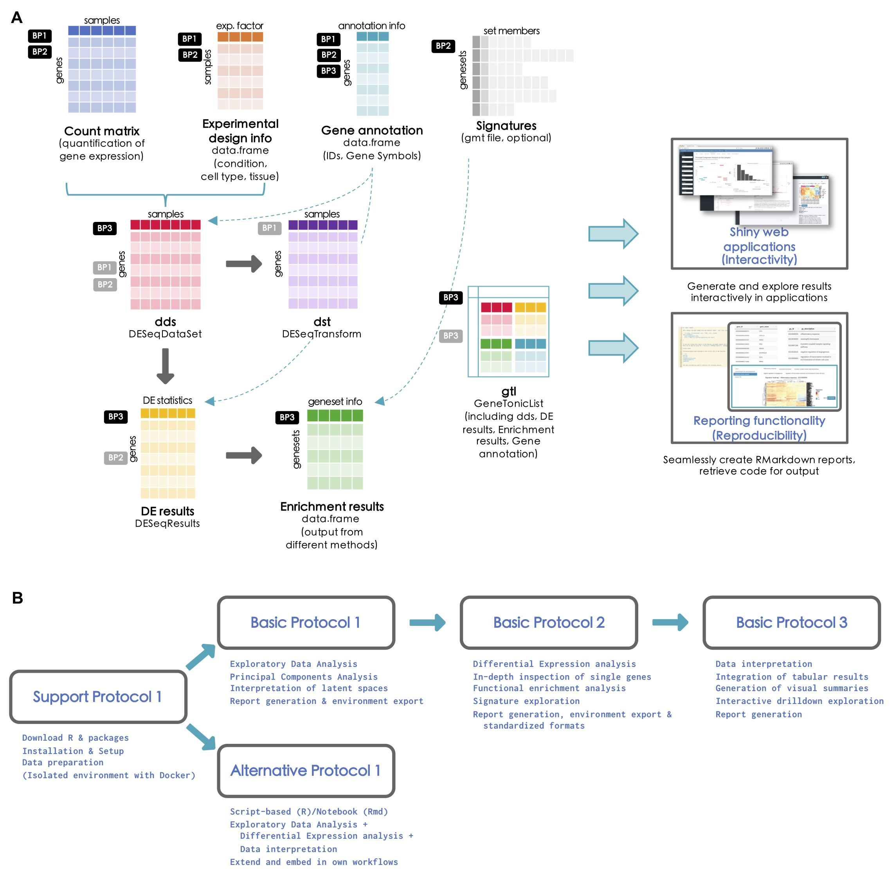

**Compiled date**: `r Sys.Date()`

**Last edited**: `r Sys.Date()`

```{r setup, include = FALSE, cache = FALSE, eval = TRUE, echo = FALSE}
library("knitr")
opts_chunk$set(
  fig.align = "center",
  fig.show = "asis",
  eval = TRUE,
  fig.width = 10,
  fig.height = 7,
  tidy = FALSE,
  message = FALSE,
  warning = FALSE,
  size = "small",
  comment = "##",
  echo = TRUE,
  results = "markup"
)
options(replace.assign = TRUE, width = 100)
```

# Introduction

The software presented in the Basic Protocols of this article is open source and freely available as R packages from the Bioconductor project (https://bioconductor.org). The package landing page of each software tool includes self-contained instructions that can be followed to install the latest stable version (Bioconductor release 3.14 at the time of writing). `pcaExplorer`, `ideal`, and `GeneTonic` share a common set of dependencies, automatically resolved and installed if the procedure illustrated in this Support Protocol is followed.

# Necessary Resources

*Hardware*

* A desktop/laptop computer, with standard modern configuration, and an up-to-date operating system - The software packages presented in this article are distributed as R packages within the Bioconductor project, and support all platforms that can run R, including Windows (32-bit, 64-bit), MacOS (32-bit, 64-bit), or Unix/Linux systems.
* Recommended: 8-16 GB RAM


*Software*

* R version 4.1.0 or higher - latest stable releases are always available at https://cran.r-project.org/
* RStudio (optional) as Integrated Development Environment (IDE), downloadable from https://www.rstudio.com/products/rstudio/download/
* A list of R packages:
  * `BiocManager` (https://cran.r-project.org/package=BiocManager, on CRAN) 
  * `pcaExplorer` (https://bioconductor.org/packages/pcaExplorer, development version at https://github.com/federicomarini/pcaExplorer)
  * `ideal` (https://bioconductor.org/packages/ideal, development version at https://github.com/federicomarini/ideal)
  * `GeneTonic` (https://bioconductor.org/packages/GeneTonic, development version at https://github.com/federicomarini/GeneTonic)
* A modern browser supporting JavaScript (Mozilla Firefox, Google Chrome, Opera, Safari, Microsoft Edge) to run the web applications, which otherwise can be launched from inside RStudio.

*Files*

Each of the Basic Protocols will operate on the data of the `macrophage` package available at https://bioconductor.org/packages/macrophage. This package contains data from a bulk RNA-seq analysis of [@Alasoo2018] – readers interested in exploring single-cell RNA-seq datasets are encouraged to use the `iSEE` and `i2dash` packages for this purpose [@Rue-Albrecht2018;@Ustjanzew2021], as also included in the Suggestions for Further Analysis section. For an easier reproducibility of the results presented in the Basic Protocols 1 to 3, we prepared the data to be directly used in the protocols. All the prepared input for each protocol is available in the `Input_data` subfolder of the `manuscript_CPBioinfo_2021` repository. This contains the following files: 

*	A count matrix (`countmatrix_macrophage.txt`). The count matrix stores the number of times (i.e., counts) a certain feature (e.g., gene) is found in each sample, as a proxy of its expression. In the count matrix, the samples are stored in the columns, while the rows store the individual features. The individual entries can either be tab, comma or semicolon separated. The count matrix can be used as direct input to `pcaExplorer` and `ideal` and can be used to obtain the DESeq object needed for `GeneTonic` (please refer to Basic Protocol 3 on how to obtain this from the count matrix). 
*	A metadata file (`metadata_macrophage.txt`). The metadata file contains for each sample information about the relevant experimental variables. The individual samples represent the rows of the file while the columns save the different experimental variables. The file can be tab, comma or semicolon separated and can be used as direct input to `pcaExplorer` and `ideal` (refer to the inset of Fig. 2D for the expected formats). 
*	An annotation file (`annotation_macrophage.txt`). The annotation file is optional for each of the presented applications; however, we highly recommend providing an annotation file to ease the interpretation of the results. The annotation file contains the feature identifiers of the count matrix in the `gene_id` column (or in the row names) and at least one column called `gene_name` which contains a more human readable form of the feature ids (e.g., HGNC gene names if the features are gene ids [@Tweedie2021]). The annotation file can directly be used as input in all three protocols.
*	A list of gene sets (`h.all.v7.4.symbols.gmt`). The gene set list contains a gene set name in the first column, a description in the second column, and several genes in the remaining columns (one gene per column). The described format is also called Gene Matrix Transposed (GMT) format, which is commonly used by online repositories, such as the MSigDB database, or the WikiPathways database. The GMT file format is a tab delimited file format of gene sets, where each row represents a gene set. This file can be used as direct input to `ideal.`

For an overview on how the information of these files is combined together to obtain all the relevant objects discussed in this manuscript, we refer to the workflow illustrated in Fig. 1 (Strategic Planning).

```{r fig1}
#| echo = FALSE,
#| fig.cap = "**Figure 1** - Workflow schematic for the presented protocols (A). The different data formats to provide to each of the protocols are represented as tabular or list-like elements, named by the scheme followed in the procedures illustrated in this work. Dashed arrows indicate that the provided information can be used to generate or annotate another object. Solid arrows (grey) denote that an object has been derived/computed from the other where the connector originated from. The small boxes close to each element explain in which protocol each object is used as primary (black) or secondary (grey) input. On the right side, the two main approaches delivered by our software (interactivity via web applications and reproducibility via reporting) are represented. A summary of the tasks each protocol accomplishes is detailed in (B) – linked together from the setup and installation, all the way down to the data interpretation."

```

# Protocol Steps with Steps Annotations

1.	Download and install R.  
    The R language and environment for statistical computing is required to install and run `pcaExplorer`, `ideal`, and `GeneTonic`, as well as all their dependencies.  
    You need to download and install the latest stable release of R from https://cran.r-project.org/, making sure to select the appropriate version for the operating system in use. At the moment of writing, R version 4.1.1 (‘Kick Things’) is available, released on 2021-08-10.

2.	Download and install RStudio (optional).  
    The RStudio integrated development environment (IDE) is a set of integrated tools, including a console, a syntax-highlighting editor that supports direct code execution, and a set of tools for plotting, viewing history, debugging and managing the workspace. While RStudio itself is not strictly necessary to run R and its packages, RStudio requires an installation of R in order to properly function.  
    The latest stable version of RStudio IDE can be downloaded from https://www.rstudio.com/products/rstudio/download/, selecting the version corresponding to the operating system. For the installation itself, follow the instructions appearing when opening the exe/dmg/rpm file.

3.	Setup Bioconductor.  
    To download and install Bioconductor packages, `BiocManager` is a small utility package available on CRAN, able to correctly resolve package dependencies in both the CRAN and Bioconductor repositories, making sure that the correct release version is used.
    Open R and type this command to install `BiocManager` (this is required only once per R installation):

    ```{r eval=FALSE}
    install.packages("BiocManager")
    BiocManager::install()
    ```

4.	Install the `pcaExplorer`, `ideal`, and `GeneTonic` packages.  
    Use `BiocManager` to install the latest release versions of the packages, matching the installed version of R. To do so, run the following command:

    ```{r eval=FALSE}
    BiocManager::install(c("pcaExplorer", "ideal", "GeneTonic"), dependencies = TRUE)
    ```

    Setting dependencies to `TRUE` will also download the packages used when running the vignettes and the examples, and is therefore recommended when getting to know the functionality. This operation is to be completed once per R installation - installed packages can be updated to their current version with

    ```{r eval=FALSE}
    BiocManager::install()
    ```

    Answer ‘yes’ when prompted in the console to download and install a potentially large set of packages.

5.	Verify the installation.  
    Confirm that the updated Bioconductor is valid for your version of R, and make sure that all packages are available in their current release.

    ```{r eval=FALSE}
    BiocManager::valid()
    ```

    While R and Bioconductor maintain both a stable and a development version at all times, regular users should use the (stable) release version (unless a particular need arises for a functionality in the development branch).  
    To verify the correct installation of the `pcaExplorer`, `ideal`, and `GeneTonic` packages, run this command:

    ```{r eval=FALSE}
    library("pcaExplorer")
    library("ideal")
    library("GeneTonic")
    ```

    If the R console returns no errors (i.e., if messages about dependencies being loaded, or information on the package versions are not problematic), the installation process is successfully completed.
    
6.	Download the example data from the dedicated repository (optional).  
    Navigate to the GitHub repository https://github.com/AnnekathrinSilvia/manuscript_CPBioinfo_2021/, which contains reproducible RMarkdown files to replicate the Basic Protocols, together with the `macrophage` dataset and some derived objects that are expected to be used in the protocol steps. This can be done in two ways:

    - cloning the repository from the command line (click on the Code button, and copy the address to checkout)

    ```{bash eval=FALSE}
    # via https
    git clone https://github.com/AnnekathrinSilvia/manuscript_CPBioinfo_2021.git 
    # via ssh
    git clone git@github.com:AnnekathrinSilvia/manuscript_CPBioinfo_2021.git 
    ```

    - downloading a zip archive of the repository by clicking on the Code button, and subsequently on the ‘Download ZIP’ link.
    
    While this step is optional, it is recommended to work in a self-contained project folder, ensuring the relative paths are working correctly across systems. This is straightforward by double-clicking on the `manuscript_CPBioinfo_2021.Rproj` file, which opens up an instance of RStudio pointing at the correct working directory.

7.	Download and use a Docker image with all required packages (optional).  
    In addition to the common installation procedure, we provide a Docker image containing all the R packages and the necessary dependencies, served in an RStudio environment. This enables the user to spin up a fully operational instance and explore the functionality of all three applications along the protocols.  
    Docker is an open platform for developing, shipping, and orchestrating micro services, e.g., software applications. If required, install Docker (https://docs.docker.com/get-docker/) selecting the version suitable for your operating system.  
    The definition of the `Dockerfile` is specified in the content of the `manuscript_CPBioinfo_2021` repository, and is built on top of the `bioconductor_docker:RELEASE_3_14` image.
Retrieve the image for the federicomarini/pigt_currprotbioinfo:3_14 from the DockerHub (https://hub.docker.com/repository/docker/federicomarini/pigt_currprotbioinfo) with

    ```{bash eval=FALSE}
    docker pull federicomarini/pigt_currprotbioinfo:RELEASE_3_14
    ```

    To run a container with all packages pre-installed and an instance of RStudio Server, run the command

    ```{bash eval=FALSE}
    docker run -e PASSWORD=bioc -p 8787:8787 federicomarini/pigt_currprotbioinfo:RELEASE_3_14
    ```

    Open your browser at the address localhost:8787, enter ‘`rstudio`’ as a username and ‘`bioc`’ as a password (as specified in the command above), with port 8787 being mapped between the Docker container and your host machine. This will conveniently open RStudio Server in a sandbox-like environment, which also contains the reproducible workflows mentioned in Step 6. 

<hr>

# Session information {-}

```{r}
BiocManager::version()
sessionInfo()
```

<hr>

# References

